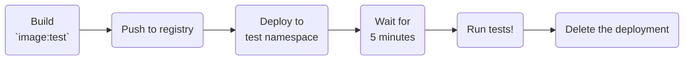

Let's have your Actions runners build and test themselves!

{: .light .shadow .rounded-10}
{: .dark .shadow .rounded-10}

**The end product is an automated check on images for fast feedback on each change.**

This uses GitHub’s hosted runners and a commercial cloud Kubernetes cluster to build and test each change to the image.  The finished image can then be signed, scanned, and pulled into internal environments as needed for the self-hosted crowd - enabling image reuse across enterprise platforms.

> The approach works just as well fully disconnected, having self-hosted runners build and test themselves.  This is how I’d originally developed and ran this for production users before realizing there should be a public examples on how to do this - hop down to the [airgap caveats](#airgap-caveats) for what else you'll need.
{: .prompt-info}

This time, we're going to build, test, and publish a rootless/sudoless D-in-D capable runner.  This is usually a nice middle ground between "can't `--privileged` at all" and "free for all cluster" - you can do a lot of container-y things without having to mess with [container hooks](https://github.com/actions/runner-container-hooks) or [kaniko](https://github.com/GoogleContainerTools/kaniko) and still keep some guardrails in place.



We're going to walk through the workflow above step-by-step.  Here's the finished files for the impatient. 😊

- Finished [container image](https://github.com/some-natalie/kubernoodles/pkgs/container/kubernoodles%2Frootless-ubuntu-focal) to use
- [Dockerfile](https://github.com/some-natalie/kubernoodles/blob/main/images/rootless-ubuntu-jammy.Dockerfile) that builds the image
- [workflow](https://github.com/some-natalie/kubernoodles/blob/main/.github/workflows/test-jammy-dind.yml) file that builds and tests it
- [workflow](https://github.com/some-natalie/kubernoodles/blob/main/.github/workflows/weekly-cleanup.yml%23L9-L30) file that deletes untagged images once a week

## Assumptions and other gremlins

First, some assumptions!

- **One repo for all the images** to enable a single place to work from for building, scanning, and otherwise collaborating on internal Actions compute.  If I can't have 5 teams share a single Python image, then they still can manage to coexist in a repository.
- Issues and PRs track requests and changes to 👆 … you can use other things, but if you’re already in the repo, why go anywhere else?
- Internal visibility of this repository and these images is a 👏 very 👏 good 👏 thing 👏 to allow platform teams to scale without a ton of extra headcount for each image.  Developers can see what goes in to building it, investigate and send PRs to fix things themselves, you can inherently track changes ... etc.

> Kubernoodles is a reference architecture, sure, but it's also a _working demo_ repository.  I use it at work to show how to run [actions-runner-controller](https://github.com/actions/actions-runner-controller) within highly-regulated industries to prioritize maximum developer freedom and minimal staffing overhead.  There are design choices you are going to change to bring this into your company.  I'll call these out as best I can.
{: .prompt-info}

## Getting squared away

Up front, you'll need:

- A test namespace in a cluster, which isn't _truly_ isolated but we simply need some resource quotas for testing.  If you've been following along, it's already created and called `test-runners`.
- A way to deploy into that namespace / secret stored.  We're using all GitHub features for this.
- A registry to pull from and push to.  We're using GitHub Packages for this.

## When to run this test?

This workflow builds and tests proposed changes to runners in a dedicated namespace.  In my opinion, these don't need to be isolated onto another cluster, but it does need some resource constraints that a namespace could provide so as not to interfere with "real jobs".  It should at least run

- on PR to the files changing the image
- on demand, which is handy for troubleshooting

It shouldn't run on changes to files that don't go in to that image.  Don't build and deploy a bunch of containers for documentation changes.

```yaml
name: 🧪 Test Ubuntu Jammy (22.04 LTS) runner

on:
  workflow_dispatch:
  pull_request:
    branches:
      - main
    paths:
      - "images/rootless-ubuntu-jammy.Dockerfile"
      - "images/**.sh"
      - "images/software/*"
      - ".github/workflows/test-jammy.yml"
```

ℹ️ A small note on names - GitHub sorts all workflows alphabetically w/o grouping in the Actions tab.  Unicode characters allow "groups" in a hacky way.  Look at this logical grouping of things:

{: .light .w-50 .shadow .rounded-10}
{: .dark .w-50 .shadow .rounded-10}

🤩 So much better, am I right?

## Build it

After all these years, here's an appropriate use for `latest` tag!  We're going to use `test` though, since I 🙈 _shame_ 🙈 actually use `latest` in my demo deployment.  This checks out our repository, logs in to the container registry for our finished file using JIT [automatic token authentication](https://docs.github.com/en/actions/security-guides/automatic-token-authentication), then builds and pushes the container.  Nothing fancy going on yet. 🥱


```yaml
  build:
    name: Build test image
    runs-on: ubuntu-latest # use the GitHub-hosted runner to build the imag

    steps:
      - name: Checkout
        uses: actions/checkout@v4

      - name: Login to GHCR
        uses: docker/login-action@v3
        with:
          registry: ghcr.io
          username: ${{ github.actor }}
          password: ${{ secrets.GITHUB_TOKEN }}

      - name: Build and push
        uses: docker/build-push-action@v5
        with:
          file: "images/rootless-ubuntu-jammy.Dockerfile"
          push: true
          tags: ghcr.io/some-natalie/kubernoodles/rootless-ubuntu-jammy:test
```


## Deploy it

This is primarily a demonstration that prioritizes neutrality / portability across vendors, it uses a vanilla Kubernetes implementation and not a specific Action to not be opinionated on vendor specifics.  If you're deploying into a managed Kubernetes service in Azure/AWS/etc., use their official Action or CLI tooling on your runner image instead.  This step runs using secrets and variables defined for the `test` environment.  You can read more about defining and using environments (such as "test" and "prod") in the [docs](https://docs.github.com/en/actions/deployment/targeting-different-environments/using-environments-for-deployment).

>There's a questionable maneuver on writing the config file to disk here.  I talked about the reasoning and risks on doing this [here](../threat-modeling-actions#a-questionable-maneuver).  **tl;dr** is that is probably fine so long as it's safe to assume the runner executing this task is both ephemeral and has no other interactive task that could hijack the credentials in the time it's running.
{: .prompt-warning}

The GHCR login is used to bypass rate limits on pulling the OCI image for the listener on the runner scale set and runner images.  It is not _strictly_ necessary, but most large companies run the risk of hitting API rate limits.  This step avoids that in most cases.

Deploying is a straightforward Helm chart with the values that we checked out at the start of the step, injected with some [secrets](https://docs.github.com/en/actions/security-guides/using-secrets-in-github-actions) and [variables](https://docs.github.com/en/actions/learn-github-actions/variables) that target the test environment.  The deployments are kept in the [`deployments` directory](https://github.com/some-natalie/kubernoodles/tree/main/deployments) of the project.

Finally, there are lots of methods to determine how healthy a Kubernetes deployment is and each project has their own opinion.  I've chosen to use a dead simple `sleep 300` to wait for 5 minutes to allow the new runner image to go where it needs, initialize, and connect to GitHub for a task.  It should be plenty enough time to succeed.  Other methods can be swapped in easily enough.


```yaml
  deploy:
    name: Deploy test image to `test-runners` namespace
    runs-on: ubuntu-latest # use the GitHub-hosted runner to deploy the image
    needs: [build]
    environment: test

    steps:
      - name: Checkout
        uses: actions/checkout@v4

      - name: Login to GHCR
        uses: docker/login-action@v3
        with:
          registry: ghcr.io
          username: ${{ github.actor }}
          password: ${{ secrets.GITHUB_TOKEN }}

      - name: Write out the kubeconfig info
        run: |
          echo ${{ secrets.DEPLOY_ACCOUNT }} | base64 -d > /tmp/config

      - name: Update deployment (using latest chart of actions-runner-controller-charts/auto-scaling-runner-set)
        run: |
          helm install test-jammy-dind  \
            --namespace "test-runners" \
            --set githubConfigSecret.github_app_id="${{ vars.ARC_APP_ID }}" \
            --set githubConfigSecret.github_app_installation_id="${{ vars.ARC_INSTALL_ID }}" \
            --set githubConfigSecret.github_app_private_key="${{ secrets.ARC_APP_PRIVATE_KEY }}" \
            -f deployments/helm-jammy-dind-test.yml \
            oci://ghcr.io/actions/actions-runner-controller-charts/gha-runner-scale-set

        env:
          KUBECONFIG: /tmp/config

      - name: Remove kubeconfig info
        run: rm -f /tmp/config

      - name: Wait 5 minutes to let the new pod come up
        run: sleep 300
```


## Test it

Let's make sure our runner image works.  This step runs only on the test runner, time limited to 15 minutes before failure to prevent stalling or hangups.

Think carefully about what tests to run?  In this case, we're doing the following:

- Dumping some debug info to the console ([test code](https://github.com/some-natalie/kubernoodles/blob/main/tests/debug/action.yml))
- Docker works and is available ([test code](https://github.com/some-natalie/kubernoodles/blob/main/tests/docker/action.yml))
- `sudo` access doesn't work ([test code](https://github.com/some-natalie/kubernoodles/blob/main/tests/sudo-fails/action.yml))
- Container Actions work as expected ([test code](https://github.com/some-natalie/kubernoodles/tree/main/tests/container))

Much more on using Actions to test your Actions runners next time. 😊

```yaml
  test:
    name: Run tests!
    runs-on: [test-jammy-dind]
    needs: [deploy]
    timeout-minutes: 15

    steps:
      - name: Checkout
        uses: actions/checkout@v4

      - name: Print debug info
        uses: ./tests/debug

      - name: Sudo fails
        uses: ./tests/sudo-fails

      - name: Docker tests
        uses: ./tests/docker

      - name: Container Action test
        uses: ./tests/container
```

## Remove that deployment

Now use helm to uninstall the test chart.  The only thing to call out here is that `if: always()` means that it will always run, regardless of the success of any other step.  This is important because we want to make sure that the deployment is also deleted on failures.


```yaml
  remove-deploy:
    name: Delete test image deployment
    runs-on: ubuntu-latest # use the GitHub-hosted runner to remove the image
    needs: [test]
    environment: test
    if: always()

    steps:
      - name: Checkout
        uses: actions/checkout@v4

      - name: Write out the kubeconfig info
        run: |
          echo ${{ secrets.DEPLOY_ACCOUNT }} | base64 -d > /tmp/config

      - name: Deploy
        run: |
          helm uninstall test-jammy-dind --namespace "test-runners"
        env:
          KUBECONFIG: /tmp/config

      - name: Remove kubeconfig info
        run: rm -f /tmp/config
```


## Handling failures

Speaking of failures, let's talk about how to handle them.  This job runs as a PR check, so failures are fine so long as they're not merged.  Merging into the main branch is gated by [repo rules](https://docs.github.com/en/repositories/configuring-branches-and-merges-in-your-repository/managing-rulesets/about-rulesets) to prevent changes that don't pass the tests.  Here's what that looks like:

{: .light .w-75 .shadow .rounded-10}
{: .dark .w-75 .shadow .rounded-10}

I do not feel the need to alert anyone on failure of a PR check, but it's entirely possible to do that by opening an issue on failure that's assigned to someone(s) and putting into a Kanban board.[^1]

## Keeping things tidy

As expected, this generates a bunch of untagged images - each PR may have a few checks and all reuse the `test` tag.  They eat up a ton of disk space over time for no good reason.  Luckily, cleaning this up can also be regularly scheduled with a marketplace Action called [container-retention-policy](https://github.com/snok/container-retention-policy).  Here's the step to add to a routine cleanup job:


```yaml
job:
  clean-ghcr:
    name: Delete old unused container images
    runs-on: ubuntu-latest
    strategy:
      fail-fast: false
      matrix:
        runner:
          - ubuntu-focal
          - podman
          - rootless-ubuntu-focal
          - ubuntu-jammy
          - ubi8
          - ubi9
    steps:
      - name: Delete untagged containers
        uses: snok/container-retention-policy@v2
        with:
          image-names: kubernoodles/${{ matrix.runner }}
          cut-off: Two hours ago UTC
          timestamp-to-use: created_at
          account-type: personal
          filter-tags: null*
          skip-tags: latest, v*
          token: ${{ secrets.GHCR_CLEANUP_TOKEN }}
```


The full [workflow file](https://github.com/some-natalie/kubernoodles/blob/main/.github/workflows/weekly-cleanup.yml) also closes issues and PRs that are inactive and a few other repo maintenance chores.  The important thing to note is that the JIT read/write Packages scope doesn't allow for image deletion, so you must set a personal access token that has that privilege and store it in Secrets.

## The other part of tidy

{: .right .w-50 .shadow .rounded}

One more lesson learned the hard way:  Lint your pull requests.  All of them.  No exceptions.

YAML is [notoriously unfriendly](https://ruudvanasseldonk.com/2023/01/11/the-yaml-document-from-hell) at times and this step prevents a ton of ~~debugging~~ pain and suffering.

This project uses [super-linter](https://github.com/super-linter/super-linter) to lint _everything_.  Across tons of teams with different conventions, this keeps a consistent quality across the board.  Here's the [workflow file](https://github.com/some-natalie/kubernoodles/blob/main/.github/workflows/super-linter.yml) and all of the linting [configurations](https://github.com/some-natalie/kubernoodles/tree/main/.github/linters) that I use.

Note it also improves our overall security posture by using Hadolint to enforce the use of specific upstream registries as well! 🧹

## Lessons learned the hard way

- "Hybrid cloud" sounds simple, but is tricky to execute.  By building in the cheapest and most open place you can (commercial cloud), then moving the finished artifact (runner image) to more isolated enclaves, it reduces the number of ~~things to go wrong~~ _differences_ between each provider/location.
- Tiny discrete images that do one thing and do it well is the most idiomatic use of containers.  I've found this pattern does poorly here due to labor spend per image, then needing teams to rework their builds to fit this paradigm.
- Big pods are not bad - Consistent caching (and invalidation as needed) of build tools in persistent read-only volumes is difficult, whereas caching complete images that don't change too often by setting your `imagePullPolicy: IfNotPresent` is simple.
- There's a balance somewhere on the number and size of images the team supports versus the amount of time spent on each one.  Each company will have to find that on their own.

My bias to big pods not being _that_ bad is that admin/dev/maintenance time is extremely expensive and time spent flinging around big containers is cheap.

## Airgap caveats

Naturally, the next question is "but I can't have internet though".  I wrote this without internet access the first time, so it's entirely possible. 😇

{: .w-75 .shadow .rounded-10}
_When GHES first shipped Actions in 3.0, this was a fun thing to figure out._

You'll need to fling across:

- the base images (eg, `ubuntu`, `ubi`)
- all of the software and certificates and such that you'll need
- OCI helm charts and images for the ARC release you'll use from [here](https://github.com/actions/actions-runner-controller/releases/tag/gha-runner-scale-set-0.6.1)
- all of the actions referenced in the workflow above

> Another side project of mine, [skilled teleportation](https://github.com/some-natalie/skilled-teleportation), provides a simple bundler to move GitHub Actions from low to high using [actions-sync](https://github.com/actions/actions-sync).
{: .prompt-tip}

## Next time

Way more than strictly necessary on writing infrastructure tests in custom Actions for your runners. 📋✅

---

## Footnotes

[^1]: A walkthrough on how to alert on failures with issue creation that is here - [Self-updating build servers, automatically](../diy-updates-on-runners/)
