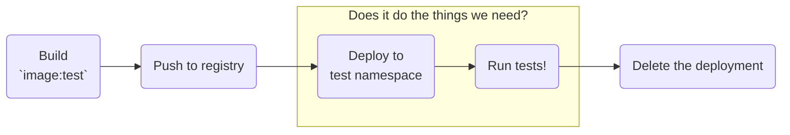

[Last time](../kubernoodles-pt-7), we built a pipeline to test our custom CI container images on each proposed change.  It built and launched a runner, dumped some debug information to the console as a "test", then removed itself.  This is valuable, but definitely not robust enough to save serious engineering hours.



To do that, let's spend more time in the highlighted box of the above diagram.  We'll write comprehensive tests for our runners, using GitHub Actions to test itself.

Many of our basic infrastructure availability tests can be run as [composite Actions](https://docs.github.com/en/actions/creating-actions/creating-a-composite-action) for reusability across different custom images.  Mostly, they wrap simple shell scripts to verify that something does or does not work as expected using the most basic utilities wherever possible.  These are all stored in the `~/tests` directory of our runner image repository ([link](https://github.com/some-natalie/kubernoodles/tree/main/tests)), then called by the workflows that build/test changes to the runners on pull request.

## Test #0

The first test isn't explicitly a test - it's the prior PR checks that validate the image:

- can be built ([example](https://github.com/some-natalie/kubernoodles/blob/main/.github/workflows/test-jammy-dind.yml%23L15-L46))
- deployed via a Helm chart
- initialize
- connect to GitHub (cloud or server) to receive tasks to run

I've never been a fan of implicit testing, especially those that have multiple steps, but this case doesn't have a succinct or tidy way to avoid it.  The reason behind the structure of the build/deploy/test workflow is to try to isolate failures in each of those discrete steps.

## How to write a test

GitHub Actions, like most infrastructure task dispatch / automation tools, uses shell exit codes[^codes] to determine success or failure.  Any non-zero status of a command is interpreted as failure and will report as such back to the orchestrator, failing our Actions job.

Here's an example of using that principle to verify that Python 3.10 is available for our jobs to use:

```yaml
name: "Python 3.10 check"

description: "Ensure Python 3.10 is available"

runs:
  using: "composite"
  steps:
    - name: "Python 3.10 is available"
      shell: bash
      run: |
        python3 -V | grep "3.10"
```

It's printing out the Python version, piping that output into the `grep` command, which then looks to see if the string `3.10` is there.  If it is, the exit code will be `0` and GitHub Actions will be a happy camper.  If not, the step fails and we should probably investigate.

This gets tricky when you try to prove a negative.  It's not wise to give `sudo` privileges without a _really_ good reason, but passing a test on "failing as expected" isn't intuitive either.  Here's an example using exit codes to verify that `sudo` must fail:

```yaml
name: "Sudo fails"

description: "Make sure `sudo` fails"

runs:
  using: "composite"
  steps:
    - name: "Sudo fails"
      shell: bash
      run: |
        if [ $(sudo echo "test") == "0" ]; then
          echo "sudo should fail, but didn't"
          exit 1
        else
          echo "sudo failed as expected"
          exit 0
        fi
```

In practice, this test _also_ includes verifying that the UID[^uid] and EUID that the agent is also non-privileged.  It does no good to remove the `sudo` executable if you're already running as root. 😊

Since failure is the desired outcome, the test is wrapped with a simple if/else/fi loop that swaps 0 in for any non-zero (desired) value.  Using `echo` statements to be explicit about the conditions needed to pass/fail should improve long-term maintainability, as does keeping the test script scoped to a single task.

## Using a test in a workflow file

Once we have the test written, using it as a PR check is simple.  For the testing step in the workflow we built out [last time](../kubernoodles-pt-7), add the following (for each test you want to run):

```yaml
      - name: Checkout # needed to access tests within the repo
        uses: actions/checkout@v4

      - name: Print debug info
        uses: ./tests/debug

      - name: Sudo fails
        uses: ./tests/sudo-fails

      - name: More tests go here
        uses: ./tests/yet-another-test
```

This keeps our tests with the rest of our files that generate the images for easy collaboration within the project.  GitHub Actions, as a whole, don't need to be part of the marketplace in order to be helpful.  Since these are more than likely internal and not public, they're not listed on the marketplace in their own individual repositories.  They can be copied in to any project wanting to use them.

## Human-friendly summary of tests

Lastly, having a friendly "at-a-glance" view of all the tests that are performed is increasingly important as the number of tests increase.  Isn't this beautifully simple to figure out all is alright or which one needs attention?

{: .dark .shadow .rounded-10}
{: .light .shadow .rounded-10}

To do it, we can set [step summaries](https://docs.github.com/en/actions/using-workflows/workflow-commands-for-github-actions%23adding-a-job-summary) to make that pretty output within the tests for each runner.  Setting a header in the first lines of `~/.github/workflows/test-RUNNERNAME.yml` ([example](https://github.com/some-natalie/kubernoodles/blob/main/.github/workflows/test-jammy-dind.yml%23L95-L99)) is done in that file like so:

```yaml
      - name: Setup test summary
        run: |
          echo '### Test summary 🧪' >> $GITHUB_STEP_SUMMARY
          echo ' ' >> $GITHUB_STEP_SUMMARY
          echo '- ✅ runner builds and deploys' >> $GITHUB_STEP_SUMMARY
```

From here, edit the script running each test to _also_ output a bullet point summary in Markdown, as shown [here](https://github.com/some-natalie/kubernoodles/blob/main/tests/docker/action.yml%23L13-L21) in `~/tests/docker/action.yml`:

```yaml
    - name: "Docker test"
      shell: bash
      run: |
        docker run hello-world
        if $? -ne 0; then
          echo "- ❌ docker run hello-world failed" >> $GITHUB_STEP_SUMMARY
        else
          echo "- ✅ docker run hello-world succeeded" >> $GITHUB_STEP_SUMMARY
        fi
```

## All about the existing tests

There's a handful of tests already written and in use in the `kubernoodles/test` directory for the images built in that repository.  Here's a quick summary of what they do, if you'd like to copy them into your own project.

### Debug info dump

([link](https://github.com/some-natalie/kubernoodles/blob/main/tests/debug/action.yml))  This test dumps commonly needed debugging info to the logs, including:

- `printenv` for all available environment variables
- `$PATH` to show the loaded paths for the executables called
- Information about the user running the agent from `whoami` and returning the UID, groups and their GIDs

This step outputs information without checking any values.  Pipe the output to `grep` to look for something if it's important to do here.

### Sudo status

([link](https://github.com/some-natalie/kubernoodles/blob/main/tests/sudo-fails/action.yml))  Verifies that `sudo` fails, that the process can't run as user ID `0` (running as or effectively as root), and isn't a member of commonly privileged groups.

([link](https://github.com/some-natalie/kubernoodles/blob/main/tests/sudo-works/action.yml))  Verifies that `sudo` works.

💡 Since these two test opposite things, pick the one applicable to your use case.

### Docker

([link](https://github.com/some-natalie/kubernoodles/blob/main/tests/docker/action.yml))  Prints some information to the console logs about the state of `docker` and the `bridge` network that it uses (so as to check MTU, among other things).  It will then pull and run the `hello-world` image.  It also checks that [Compose](https://docs.docker.com/compose/) is available.

### Podman

([link](https://github.com/some-natalie/kubernoodles/blob/main/tests/podman/action.yml))  This test is the same general container test as the Docker tests, but using the Red Hat container tooling instead.  It does the following:

- prints common debug information to the console
- `podman` can pull and run the `hello-world` container
- `docker` aliases work, so these can be a reasonably drop-in replacement
- `buildah` is installed and available
- `skopeo` is installed and available
- `podman compose` is installed and available

### Container Actions work

([link](https://github.com/some-natalie/kubernoodles/tree/main/tests/container))  This test builds and runs a very simple [Docker Action](https://docs.github.com/en/actions/creating-actions/creating-a-docker-container-action).  It prints a success message to the console before exiting.  Run this to verify that this class of Actions work as expected.

### Arbitrary software

This pattern extends well to any other arbitrary software you want installed, building slightly on the example of Python we opened with.  Follow the same pattern of using exit codes to either find the executable with `which` or call it with the version flag for that program, pipe to `grep` if you're checking for specific versions or other info, etc.

Finishing that version check for Python 3.10 would look like this:

```yaml
name: "Python 3.10 check"

description: "Ensure Python 3.10 is available"

runs:
  using: "composite"
  steps:
    - name: "Python 3.10 is available"
      shell: bash
      run: |
        python3 -V | grep "3.10"
        if $? -ne 0; then
          echo "- ❌ Python 3.10 not available" >> $GITHUB_STEP_SUMMARY
        else
          echo "- ✅ Python 3.10 works!" >> $GITHUB_STEP_SUMMARY
        fi
```

## Conclusions

As we've seen so far, this pattern of using containers in Kubernetes similarly to virtual machines leads to large images.  Balancing these large images means having _more_ images to maintain.  Comprehensive test coverage of what's necessary for each image to function allows this maintenance to be easier and is another stepping stone to automating more of this infrastructure.  What better system to use to than to have your GitHub Actions runner image(s) test itself?

## Next time

Diving deep into MTU - what it is, how it works, why it's important for actions-runner-controller implementations, and how to stop it from 🌟 ruining your day 🌟

---

## Footnotes

[^codes]: The [Linux documentation project](https://tldp.org/LDP) book on [Advanced Bash Scripting](https://tldp.org/LDP/abs/) has a ton of information about [exit status codes](https://tldp.org/LDP/abs/html/exit-status.html) and a breakdown of the ones with [special meanings](https://tldp.org/LDP/abs/html/exitcodes.html).
[^uid]: More about user IDs (`uid`), group IDs (`gid`), and effective user IDs (`euid`) on [Wikipedia](https://en.wikipedia.org/wiki/User_identifier) and [Red Hat's blog](https://www.redhat.com/sysadmin/user-account-gid-uid).  Long story short - if any of these values are `0`, it's running as root or has root permissions.
