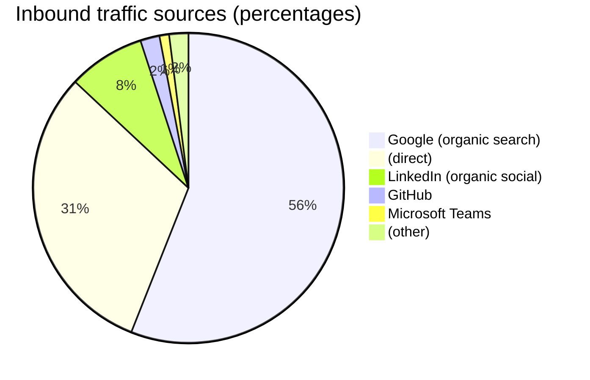

I added Google Analytics to my site in mid-April and then promptly forgot about it until about a month ago.  It's become a captivating new toy to understand my website traffic over the quiet holiday season. 🕵️‍♀️

## Inbound sources

💡 The distribution of inbound traffic sources was my first observation.

While it seems important to optimize for discovery and announce posts on social media, the "long tail" of sources was fascinating.  A noticeable sum of traffic came in from various Microsoft Teams tenants.  I cannot tell who they're associated with, as they all show up as coming from `statics.teams.cdn.office.net`.

The "other" category was pretty interesting in that it can carry a lot more information.  It seems as though many folks save the link to a website in internal wiki systems.  This means I now have a considerable list of Confluence, Jira, and other internal "enterprise-y" service URLs. 😇

## Page views

For top pages, it wasn't surprising that the [guide to building custom images](../kubernoodles-pt-5) and [using Kaniko in actions-runner-controller](../kaniko-in-arc) are the top pages by view count over that time.  These both correspond to conversations I have regularly in my day job.  Also popular is my BSides talk on [threat modeling the GitHub Actions ecosystem](../threat-modeling-actions) and [architecture guide to self-hosted runners](../arch-guide-to-selfhosted-actions).  My rant about how [Firecracker doesn't solve every container security concern](../stop-saying-just-use-firecracker) still does quite well too.

🏡 The rest of the top pages weren't related to my job - intriguing to me that it sees so much traffic.  Raspberry Pi boards became [desktops for kids](../kiddo-pi), a [home media server](../kodi-setup), and an [OpenWRT router](../openwrt-setup) this year.  The maintenance on all of these was [completely automated](../diy-updates-on-runners) for minimal upkeep.

## Geography

🗺️ The split of users by geographic region was the last neat observation.  The website viewership, as best that can be determined, is about half North American, mostly in the US.  The remaining half is mostly an even-ish mix of EU member countries.  There is some, but not much, users coming from outside of those two zones.  I'm not sure what this means or what, if anything, should be done about it.

## Lessons learned

{: .shadow .rounded-10 .w-75}

In looking at the data so far, a couple things stand out.
- Search engine optimization is worth some thought.  Being discoverable drives the biggest share of traffic.
- It seems like each post should be announced on LinkedIn, Slack (internally), Mastodon, etc.  That also helps, as it seems that after a post, the traffic bumps on the site for a short while.
- Users tend to not explore much - navigation beyond the thing they landed on doesn't appear common.

In the new year, I'd like to learn more about:
- What, if any, sharing options on the site get used?  I have a couple "share link" buttons - including directly to LinkedIn and Mastodon.  It'd be handy to understand what, if anything, is used.
- What does "engagement" mean as opposed to the count metrics?  It's intuitive to grasp "total users" or "total views", but what's a "scroll event" or "click" on a static website?  Seems like there's a lot more to be known here.
- While it was extremely simple to get going with Google Analytics, what would self-hosting or using another metrics provider look like?
- What _else_ could I do with a static site generator? 

I have exactly zero ambitions for my website.  It's liberating to not expect anything of a hobby.  At best, it's a living résumé and a place to toss some other things to share.  This was a neat way to learn a little bit about traffic analytics now that there's enough data to parse. 🥂
