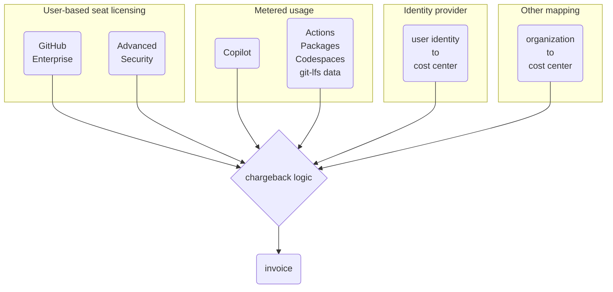

One of the most common questions asked by companies adopting GitHub Enterprise is how to **know who's using what.**  This information is critically important to government agencies, non-profits, consultancies, and any other customer-billable business.  Even without these needs, it's valuable to identify usage and growth trends for cost predictability, opportunities to coach teams to optimize usage, and much more.

At a high level, we're going to need to understand four things to pull this off:

1. [How GitHub charges enterprises](#github-enterprise-cost-structure-101)
1. [Structuring your account for chargeback](#enterprise-setup)
1. [Get usage data out of GitHub](#getting-usage-data-out-of-github)
1. [Process that data to summarize charges](#processing-the-data)

Most places call this practice **"chargeback"** or **"cost center billing"**.  Each contract or business unit is responsible for its' own incurred charges.  It can be confusing because there isn't a clear one-to-one relationship between user licensing, repository/organization structures, and metered billing items to a "cost center".  Every company has some degree of uniqueness here, so while there isn't an easily reusable solution, all follow more or less this same process below.

> This information is up to date as of February 2024.  The end goal is a minimal, adaptable process to pass-through costs.
{: .prompt-info}

## GitHub Enterprise cost structure 101

There are two types of costs from GitHub that an enterprise may expect to pay.

1. User licensing for GitHub Enterprise and Advanced Security
2. Metered (pay-as-you-go) product features

**GitHub Enterprise licensing** is a simple per-user seat cost.  The list price is $21/user/month at time of publication.  This is a flat rate per unique user account in your enterprise ([documentation](https://docs.github.com/en/enterprise-cloud@latest/billing/managing-your-license-for-github-enterprise/about-licenses-for-github-enterprise#about-licensing-for-github-enterprise)).  All members consume at least this amount.

**GitHub Advanced Security** licenses are an add-on to a subset of the users above.  This license provides application security tooling and is billed per unique active contributor across all private/internal repositories where it's enabled (more on that in the [documentation](https://docs.github.com/en/enterprise-cloud@latest/billing/managing-billing-for-github-advanced-security/about-billing-for-github-advanced-security)).  The list price is $49/user/month.

**Metered products** is where life gets difficult as they're all a little different.  Some are per-user, but most are pay-as-you-go and correllated to a repository instead.  These charges are all reported on the same spreadsheet by GitHub and the monthly sum is what is charged against your Azure subscription or credit card.

- [Copilot Business](https://github.com/features/copilot) is charged per user per month, so follows many of the same conventions above.  However, it is a month-by-month user amount, so unlike annual contract licensing, your amount can vary as much as you'd like each billing cycle.  The [billing docs](https://docs.github.com/en/enterprise-cloud@latest/billing/managing-billing-for-github-copilot/managing-your-github-copilot-subscription-for-your-organization-or-enterprise) outline this in-depth.
- [Actions](https://github.com/features/actions) usage is tied to repositories.  GitHub Actions incurs no charge _from GitHub_ if you self-host your own compute, but comes at a pay-as-you-go rate if using the managed SaaS compute.  That rate depends on the size of the compute used in the job, as outlined in the [billing docs](https://docs.github.com/en/enterprise-cloud@latest/billing/managing-billing-for-github-actions/about-billing-for-github-actions).
- [Packages](https://github.com/features/packages) usage is tied to repositories _or_ organizations.  It can cost storage and egress, each at some cost per GB/month.  It incurs no cost _from GitHub_ on the self-hosted product only.  The [billing docs](https://docs.github.com/en/enterprise-cloud@latest/billing/managing-billing-for-github-packages/about-billing-for-github-packages) have the most up-to-date costs.
- [Codespaces](https://github.com/features/codespaces) provides cloud developer environments to work on projects without needing to keep code locally.  It's billed for both storage and instance size, as outlined in the [billing docs](https://docs.github.com/en/enterprise-cloud@latest/billing/managing-billing-for-github-codespaces/about-billing-for-github-codespaces).
- [Large file storage](https://git-lfs.com/) allows storage of large files in git repositories.  It's billed in data packs, which are discrete chunks of 50 GiB of storage and bandwidth.  The [billing docs](https://docs.github.com/en/enterprise-cloud@latest/billing/managing-billing-for-git-large-file-storage/about-billing-for-git-large-file-storage) will be updated as this will move to a metered model in [Q2 2024](https://github.com/orgs/github/projects/4247/views/1?filterQuery=is%3Aopen+-status%3A%22Q4+2022+%E2%80%93+Oct-Dec%22%2C%22Q2+2023+%E2%80%93+Apr-Jun%22+lfs).  Your chargeback process should not change much as a result of this.

> Do not reconfigure costs in ways that don't align to how GitHub charges for things - e.g., pricing per repository or issue opened[^issues].  There's nothing built-in to the platform to reliably account for these.  These sorts of schemes tend to be delicate and hard to maintain, as there is _no_ guarantee that GitHub won't change something it relies on.
{: .prompt-warning}

## Enterprise setup

All costs roll up to this "enterprise" umbrella, but are incurred by the people or repositories within an organization.  This means that how these organizations and/or repositories are mapped to cost centers determines the logic of creating an invoice.

{: .light .rounded-10 .w-75}
{: .dark .rounded-10 .w-75}

**This "mapping" task is simpler if a couple patterns are followed.**

- One organization tracks to one cost center (or contract, department, business unit, etc)
- Each user belongs to an organization or identity provider group that carries information about their cost center.
- There's no "mixed use" billing - eg, one user/repo/etc isn't part of multiple cost centers.

> GitHub recently shipped [custom properties for repositories](https://docs.github.com/en/enterprise-cloud@latest/organizations/managing-organization-settings/managing-custom-properties-for-repositories-in-your-organization) that can be enforced at the organization level, which would make having multiple cost centers in an organization simpler to manage _if_ you are comfortable retrieving that data through the [REST API](https://docs.github.com/en/enterprise-cloud@latest/rest/orgs/custom-properties?apiVersion=2022-11-28).  Since this data isn't included in the CSV exports from GitHub, I'm not exploring this path here.
{: .prompt-info}

## Getting usage data out of GitHub

Now that we know what data we need, let's get it out of GitHub.  We're going to need two CSV exports to correlate into an invoice.  Unfortunately, these are not both available via an API, so you'll need to set a calendar reminder to pull these manually.

1. GitHub Enterprise license usage - [directions](https://docs.github.com/en/enterprise-cloud@latest/billing/managing-your-license-for-github-enterprise/viewing-license-usage-for-github-enterprise#viewing-license-usage-on-githubcom) (or [API documentation](https://docs.github.com/en/enterprise-cloud@latest/rest/enterprise-admin/license?apiVersion=2022-11-28#list-enterprise-consumed-licenses))
1. Metered features usage - [directions](https://docs.github.com/en/enterprise-cloud@latest/billing/managing-billing-for-github-actions/viewing-your-github-actions-usage#viewing-github-actions-usage-for-your-enterprise-account)

The licence usage CSV file is named `consumed_licenses-ENTERPRISENAME-TIMESTAMP.csv`.  There is a _ton_ of information in this spreadsheet.  This export attempts to de-duplicate users across their cloud account and any connected GitHub Enterprise Server accounts, as well as if they are consuming a Visual Studio license that bundles GitHub.  It looks something like this (scroll side-to-side):

| github_com_login | github_com_name | enterprise_server_user_ids | github_com_user | enterprise_server_user | visual_studio_subscription_user | license_type | github_com_profile | github_com_member_roles | github_com_enterprise_roles | github_com_verified_domain_emails | github_com_saml_name_id | github_com_orgs_with_pending_invites | github_com_two_factor_auth | github_com_two_factor_auth_required_by_date | github_com_advanced_security_license_user | enterprise_server_primary_emails | visual_studio_license_status | visual_studio_subscription_email | total_user_accounts |
|---|---|---|---|---|---|---|---|---|---|---|---|---|---|---|---|---|---|---|---|
| user1 | User name 1 |  | TRUE | FALSE | FALSE | Enterprise | https://github.com/user1 | octodemo-enablement:Member | Member |  |  |  | TRUE |  | FALSE |  |  |  | 1 |
| user2 | User name 2 |  | TRUE | FALSE | FALSE | Enterprise | https://github.com/user2 | actions-clubhouse:Owner | Owner, Member |  |  |  | TRUE |  | FALSE |  |  |  | 1 |
| user3 | User lastname |  | TRUE | FALSE | FALSE | Enterprise | https://github.com/user3 |  | Outside collaborator |  |  |  | TRUE |  | TRUE |  |  |  | 1 |
| user4 | Test user |  | TRUE | FALSE | FALSE | Enterprise | https://github.com/user4 | octodemo-enablement:Member, octodemo:Owner | Member |  |  |  | TRUE |  | FALSE |  |  |  | 1 |
| user5 | Alice Bob | 71:octodemo.com:Member | TRUE | TRUE | FALSE | Enterprise | https://github.com/user5 | GitHub-field-collab:Owner, nathos-test:Owner, octodemo-enablement:Member, octodemo-resources:Member, octodemo:Owner, universal-exports-ltd:Member | Owner, Member |  |  |  | TRUE |  | FALSE | test_server_user@test.com |  |  | 2 |
| user6 | Named user6 |  | TRUE | FALSE | FALSE | Enterprise | https://github.com/user6 | octodemo-enablement:Member | Member |  |  |  | TRUE |  | FALSE |  |  |  | 1 |
| user7 | Seventh user |  | TRUE | FALSE | FALSE | Enterprise | https://github.com/user7 | octodemo-enablement:Member, octodemo:Owner | Member |  |  |  | TRUE |  | TRUE |  |  |  | 1 |

The resource usage file is named `RANDOMSTRING_DATE_DURATION.csv` and is only requestable by email.  It can take an hour or so to generate depending on the number of line items.  Here's an example:

| Date | Product | SKU | Quantity | Unit Type | Price Per Unit ($) | Multiplier | Owner | Repository Slug | Username | Actions Workflow | Notes |
|---|---|---|---|---|---|---|---|---|---|---|---|
| 8/16/23 | Actions | Compute - MACOS | 10 | minute | 0.08 | 10 | octodemo | ghas-committer | dependabot[bot] | .github/workflows/build.yml |  |
| 11/9/23 | Actions | Compute - MACOS_LARGE | 2 | minute | 0.12 | 1 | octodemo | larger-runner-matrix | user4 | .github/workflows/test-matrix.yml |  |
| 2/12/24 | Actions | Compute - UBUNTU | 16 | minute | 0.008 | 1 | octodemo | audit-log-polling-service | user3 | .github/workflows/audit-log-export-service.js.yml |  |
| 10/30/23 | Actions | Compute - UBUNTU_64_CORE | 53 | minute | 0.256 | 1 | some-fantastic | fedora-acs-override | user5 | .github/workflows/codeql.yml |  |
| 2/12/24 | Actions | Compute - WINDOWS | 10 | minute | 0.016 | 2 | octodemo | neovim-private | user2 | .github/workflows/release.yml |  |
| 8/16/23 | Copilot | Copilot Business | 27.2258 | user-month | 19 | 1 | octodemo |  |  |  |  |
| 11/2/23 | Packages | Data Transfer | 0 | gb | 0.5 | 1 | octodemo | Organization Packages - Data Transfer Out | user1 |  |  |
| 2/12/24 | Shared Storage | Shared Storage | 0.3549 | gb-day | 0.008 | 1 | octodemo | bookstore-demo-spring-java |  |  |  |

Note that "Shared Storage" is storage for any compute product, as it's all billed at the same rate.

> At some point in the future, much of this will be revamped as part of a new [billing overview](https://github.com/github/roadmap/issues/217) that should make this data more accessible and customizeable.  This page does not cover any of these enhancements.
{: .prompt-info}

## Processing the data

{: .w-25 .shadow .rounded-10 .right}

We're going to take the simplest route - loading it all into a spreadsheet for some simple correlations.  Create a new spreadsheet and paste the contents of each of those two CSV files into separate tabs.

Create another tab for identity provider data.  You'll get this from Azure AD, Okta, or other identity provider to map `some-natalie@github.com` (my account's email address) to the arbitrary "cost center" or "business unit" field of your company's organization chart.  This information, plus the information for each user in the columns below, will give you a sum of license types by that cost center.

- `github_com_user`
- `visual_studio_subscription_user`
- `github_com_advanced_security_license_user`

In order to map GitHub username to a human in your identity provider, you may need to have some initial user input to know that `some-natalie` is `natalie_somersall`.  If you're using GitHub's [Enterprise Managed Users](https://docs.github.com/en/enterprise-cloud@latest/admin/identity-and-access-management/understanding-iam-for-enterprises/about-enterprise-managed-users) feature, the username is _generally_ the same as the User Principal Name followed by a suffix.  It makes this additional step unnecessary.

For metered consumables, remove any charges that are outside of your window of interest using the "Date" field.  Create a new column to multiply the `Price Per Unit ($)` by `Quantity` for each line item.  Map each organization to the cost center that owns them, then summarize each charge using a [PivotTable](https://support.microsoft.com/en-us/office/overview-of-pivottables-and-pivotcharts-527c8fa3-02c0-445a-a2db-7794676bce96) or similar functionality.  This will give you a per-organization roll-up of all metered charges.  You'll now need to map that organization to a cost center as well, but that should be a small list to maintain in comparison to the many line items in the metered bill.

{: .shadow .rounded-10}

### Side note on GitHub Advanced Security

If you want to know why someone is licensed for Advanced Security, there's a third spreadsheet that will give you a list of all users across all repositories that have GHAS enabled and when they last pushed code to it so as to estimate your 90-day license reclaimation window ([download directions](https://docs.github.com/en/enterprise-cloud@latest/billing/managing-billing-for-github-advanced-security/viewing-your-github-advanced-security-usage#downloading-github-advanced-security-license-usage-information)).  The Advanced Security license file is named `ghas_active_committers_ENTERPRISENAME_2024-02-12T0752.csv`.

| User login | Organization / repository | Last pushed date | Last pushed email |
|---|---|---|---|
| user1 | user1-test-org/centralized-workflows | 12/15/23 | user1@test.com |
| user1 | user1-test-org/copilot-arcade | 12/5/23 | user1@test.com |
| user1 | user1-test-org/copilot-demo-dotnet | 1/19/24 | user1@test.com |
| user2 | Dougs-Donuts/cupcakes | 1/24/24 | user2@test.com |
| user2 | Dougs-Donuts/literate-sniffle | 12/12/23 | user2@test.com |
| user3 | company-ghas-poc-kickoff/webgoat-js | 1/16/24 | user3@test.com |
| user4 | ghas-company-demo/dependency-review-demo | 1/28/24 | user4@test.com |
| user4 | ghas-company-demo/infrastructure | 2/12/24 | user4@test.com |

In this example, there would be **4 billed users**.  The activity of `user1` on `user1-test-org/copilot-arcade` will soon roll off of that "active" user threshold of 90 days.  However, since that user is still active on other repositories more recently, they will still consume a seat for a while longer.

### Exclusions

This method _only_ captures what GitHub will directly charge you for.  Here's an incomplete list of things that it will not capture:

- Any usage of self-hosted GitHub Actions runners.  Capture this data from your hypervisor or cloud provider instead.
- Any ingest of audit log data.  It's hard to account for how much of the SIEM bill is one person or organization's events versus another.
- Network ingress/egress beyond GitHub's boundary.  There's no visibility from GitHub into artifacts or code once they leave GitHub.
- Identity provider or 2FA provider traffic ... apparently charging for this is a thing some companies do internally? 🤷🏻‍♀️
- Integrations from GitHub that are paid for separately.  If a third-party application (such as a project management or code security tool) has their own billing, that's between you and that third-party.

## Conclusions

Each organization has something unique about their pass-through billing structure.  Some treat GitHub licenses as basic overhead and consume the cost without passing it through, the same as email or endpoint protection is treated, while others recoup them from the department or customer.  It's remarkably difficult to provide _specific_ guidance on this practice given the amount of customization at play.  These are patterns that I see work well for most companies where it is not worth having significant long-term investments of developer time in cost accounting.

Clever architecture decisions, such as trying to keep hierarchy as simple as possible, ease this process.  It also helps to remove the inherent fragility based on a company's reorganizations.  While somewhat manual, this should not take long to perform month over month.[^deprecate]

## Next time

Now let's try this on hard mode - self-hosting all this goodness using GitHub Enterprise Server and _still_ having [an awesome chargeback model!](../chargeback-server)

{: .shadow .rounded-10}

---

## Disclosure

I work at GitHub as a solutions engineer at the time of writing this.  All opinions are my own.

## Footnotes

[^issues]: Yes, a customer was quite sincerely trying to figure out how to make charging their internal users by issue a thing.  I don't think that ever was implemented though.
[^deprecate]: There are improvements to this that GitHub is working on and once released, I will mark this page as deprecated.  This is more of a stop-gap measure than something that will be maintained in perpetuity.
