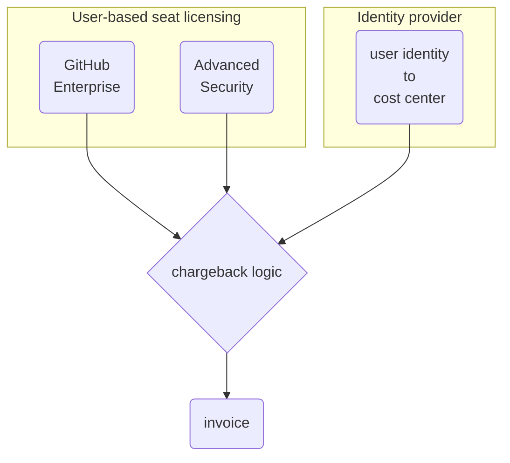

Last time, we looked at a simple ["chargeback" system for the SaaS version of GitHub](../chargeback-cloud).  As there's limited availability of the data by API, we downloaded some CSV files and used a spreadsheet's built-in analysis tools to make some invoices for each organization in the enterprise.

Things are very different on GitHub Enterprise Server, as it's self-hosted and much of the data is available in different formats/methods/etc than the Cloud product.  There really was no design of any "money changes hands internally" features.  We're going a couple places on this roller coaster ride.

1. [GitHub Enterprise Server costs](#github-enterprise-server-costs)
1. [The simplest chargeback model](#the-simplest-chargeback-model)
1. [Understanding resource usage](#understanding-resource-usage) for an expanded chargeback model
1. [What this looks like for real](#what-this-looks-like-for-real)
1. [The ugly parts of this](#considerations-on-having-done-the-thing) - having seen this multiple times in multiple companies, there's some unintended consequences to think through.
1. [Conclusions](#conclusions)

## GitHub Enterprise Server costs

This is easy!  GitHub charges you for (up to) two things, both are flat per-seat license costs.

**GitHub Enterprise licensing** is a simple per-user seat cost.  The list price is $21/user/month at time of publication.  This is a flat rate per unique user account in your enterprise ([documentation](https://docs.github.com/en/enterprise-server@latest/billing/managing-your-license-for-github-enterprise/about-licenses-for-github-enterprise#about-licensing-for-github-enterprise)).  All members consume at least this amount.

**GitHub Advanced Security** licenses are an add-on to a subset of the users above.  This license provides application security tooling and is billed per unique active contributor across all private/internal repositories where it's enabled (more on that in the [documentation](https://docs.github.com/en/enterprise-server@latest/billing/managing-billing-for-github-advanced-security/about-billing-for-github-advanced-security)).  The list price is $49/user/month.

### Suspending dormant users

All users who are not suspended consume a seat, including all dormant users.  Suspending these inactive users saves on license costs.

1. [Download the dormant users report](https://docs.github.com/en/enterprise-server@latest/admin/administering-your-instance/administering-your-instance-from-the-web-ui/site-admin-dashboard#reports) from the admin console.
2. Suspend them all [manually in the web UI](https://docs.github.com/en/enterprise-server@latest/admin/managing-accounts-and-repositories/managing-users-in-your-enterprise/suspending-and-unsuspending-users#suspending-a-user-from-the-site-admin-dashboard) or [using the SSH admin console](https://docs.github.com/en/enterprise-server@latest/admin/managing-accounts-and-repositories/managing-users-in-your-enterprise/suspending-and-unsuspending-users#suspending-a-user-from-the-command-line).

This is entirely too much work to do manually at any appreciable scale.  Fortunately, this is scriptable via your company's operations orchestrator of choice - here's an [example script](https://github.com/some-natalie/dotfiles/blob/main/scripts/ghes-suspend-all-dormants.py) in Python.

## The simplest chargeback model

Given the uncomplicated per-user costs, a basic model for chargeback on GHES looks like this:

### Manual chargebacks

If you want to follow the same general model as the cloud chargebacks, you can download the following CSV files from GitHub Enterprise Server and load them into a spreadsheet.

- [all users report](https://docs.github.com/en/enterprise-server@latest/admin/administering-your-instance/administering-your-instance-from-the-web-ui/site-admin-dashboard#reports) - note that regardless of activity, all users that are not suspended consume a seat!
- [GHAS active committers](https://docs.github.com/en/enterprise-server@latest/billing/managing-billing-for-github-advanced-security/viewing-your-github-advanced-security-usage#downloading-github-advanced-security-license-usage-information) - the number of consumed seats is the sum of unique users in this spreadsheet.
- a mapping of cost centers to user identities

### Automating information collection for chargeback

Unlike last time, this data is also easily consumed programmatically.  Here's the process, broken down step by step:

1. Suspend all dormant users ([example script](https://github.com/some-natalie/dotfiles/blob/main/scripts/ghes-suspend-all-dormants.py)).
2. Promote an enterprise admin to own all organizations in your enterprise ([gh cli extension](https://github.com/some-natalie/gh-org-admin-promote)).
3. Consume the active users report ([example script](https://github.com/some-natalie/dotfiles/blob/main/scripts/get-ghes-reports.py)).  This gets our **GitHub Enterprise licensing** data.
4. Consume the GHAS active committers data ([example script](https://github.com/some-natalie/dotfiles/blob/main/scripts/ghes-ghas-licenses.py)).  Note this relies on owning all organizations to run!
5. Consume a mapping of user identities (such as UPNs, emails, SAML identities, etc.) to cost centers from your identity provider.[^gh]  Most have an API or Report-as-a-Service function that can retrieve a couple pre-defined fields.[^idp]

My experience from here is in loading all of this raw data into a database once a month via an operations orchestration platform.  From there, an [ETL pipeline](https://en.wikipedia.org/wiki/Extract,_transform,_load) would deduplicate and otherwise clean up the data before creating invoices to feed into in-house accounting software.  GitHub was one of about two dozen tools paid for in this way.  It's possible to correlate these three sources programmatically without building a full data lake and processing pipeline.  What this part looks like will always be unique to each company.

## Understanding resource usage

{: .w-50 .shadow .rounded-10 .right}

All of the above is nowhere _near_ the entire costs associated with owning and operating infrastructure on-premises.  Here's a few thoughts on how to recoup those costs:

### Disk usage of repositories in GHES

The [all repositories report](https://docs.github.com/en/enterprise-server@latest/admin/administering-your-instance/administering-your-instance-from-the-web-ui/site-admin-dashboard#repository-reports) contains a column for raw and human readable size of the repository on disk.  If you map organization to cost center, it may be possible to account for this at an arbitrary storage charge.

However, this only accounts for data stored directly in a git repo.  Both repository and git-lfs data are stored on the `/data/user/storage` directory of GHES in a format that's difficult to correllate blobs to repos/orgs/users/etc.  **This report does not capture git-lfs data.**

There is no centralized reporting of git-lfs data in GHES.  You can see the top users in the web UI at `http(s)://ghes-url/stafftools/storage`.

> Storage is cheap.  Don't worry about this one.  If you must, divvy it equally among the cost centers sharing GHES.
{: .prompt-tip}

### Actions compute and network

There is no central reporting of GitHub Actions compute enterprise-wide.

While it is possible to query the database directly ([example](https://github.com/github/platform-samples/blob/master/sql/metrics/actions-summary.sql)), doing so is strongly discouraged.  There is no guarantee of schema stability between versions and what the database cares about may be different than what's necessary to charge back compute to a cost center.  It will not, for example, capture network ingress/egress or the compute size that the job ran on.  This makes auditing charges and dispute resolution utterly expensive nightmares.

> If you _must_, manage Actions runners by cost center and use your cloud provider to charge each pool back to the owning cost center.  This means that cost center "a, b, c, so on" has their own compute and their own bill.
{: .prompt-tip}

### Packages and Actions storage

GitHub Actions (CI) and Packages (artifact storage) share blob storage.  This is usually configured as a separate Azure Blob Storage or AWS S3 Bucket, but can also be any S3-compatible storage solution for on-premises work.  The storage is not structured in a way to make it easy to correllate who is using what.  There's no central reporting on how much is used by each user/repo/organization.

> Storage is cheap.  Don't worry about this one.  If you must, divvy it equally among the cost centers sharing GHES.
{: .prompt-tip}

### General overhead

VM or datacenter hosting bills, SIEM logging ingest/alerting/analysis, appliance backups, monitoring, on-call rotation coverage by your staff, etc. all fall under general overhead in my book.  It's annoying to outright impossible to figure out how to pass these through apart from wild guesses without inviting arguments from the participating programs.  If you must, figure it out as a flat rate per cost center.

## What this looks like for real

{: .w-50 .shadow .rounded-10 .right}

Enterprise-wide chargeback gets complicated quickly.

In a past life, I did the first iteration of this program for approximately two dozen or so tools.  GitHub Enterprise Server was one of them.  Once a month, it pulled usage data for each tool and put it into a database automatically.  A set of ETL scripts deduplicated, cleaned, and otherwise made the data usable before migrating that data into another set of tables.  The cleaned data was then used to programmatically generate invoices, sending them directly into an in-house accounting tool and via email to each owner of a cost center receiving an invoice.  Managing minimal permissions to do this safely across each tool, a central orchestration platform, a database, and accounting tool is no small undertaking.  This sort of data lake is a prime target for your threat model as well, so it involves quite a few stakeholders at large companies.

**Much more than a few CSV files are needed to pull this off.**

- Each participating tool will need minimally scoped permissions and a credential (an API key, service account, etc.) to retrieve them.
- These credentials ideally should be in a secret storage service (such as [Hashicorp Vault](https://www.vaultproject.io/), [Azure Key Vault](https://azure.microsoft.com/en-us/products/key-vault), etc.) and federated to your automation platform.
- An automation platform to run these scripts on a schedule such as [Ansible](https://www.ansible.com/), [Rundeck](https://www.rundeck.com/), or [GitHub Actions](https://github.com/features/actions).
- The scripts to pull the data needed from each tool and insert them into their respective database table.  The example scripts above will only get part of the way there.
- A database of some sort and ETL scripts to clean that data.  Across a larger company, you'll be handling many millions of lines of data each cycle.  I found most of the cleaning needed to happen around identity management and how one human may have many different variations of username across tools.
- Extracting that data into a human-readable invoice (like a PDF) and a format your accounting software can ingest (like a CSV) usually requires custom development and maintenance.
- Monitoring, testing, and maintenance of each of the above systems to have billing continuity should any piece fail.
- Usually some sort of dashboard and cost forecast mechanism to allow cost-center owners to understand their usage history and project forward for budgeting, detailing usage for optimization efforts, and more.

I'm sure there's more I'm missing here too, but that should be most of it.  It's no small task to implement and run a large-scale pass-through accounting system, but a large investment that equals (or exceeds) the cost of running licensed tools.

{: .w-50 .shadow .rounded-10}
_every whiteboard session drawing this out_

## Considerations on having done the thing

While there's a lot of bespoke technical complexities, what I've seen in common across the dozens of customers that I've walked through this process is that _**chargeback creates a conflict of interest in your developer tooling.**_

The power of your enterprise software factory is in frictionless central collaboration.  Money changing hands between budget holders introduces reasons for each to not consolidate.

### Innersourcing

The first benefit is in **organic internal collaboration across business units**, called [innersource](https://resources.github.com/innersource/fundamentals/).  While rolling out GitHub Enterprise in a prior role, I found over ten instances of a simple app to read your ID badge's barcode for tracking attendance at all-hands events.  Each business unit wrote one or more, checked it in _somewhere_, and forgot about it until it got used a few times each year.  This was wasted effort and money, to be sure, but also multiplicatively wasted on upkeep and security risk of maintaining 10 things where 1 would suffice.

This isn't true of most other tools included in these pass-through accounting.  The same number of people will need to use [Visio](https://www.microsoft.com/en-us/microsoft-365/visio/flowchart-software) (flow charts) or [BurpSuite](https://portswigger.net/burp) (appsec) or [Primavera P6](https://www.oracle.com/construction-engineering/primavera-p6/) (project management) regardless of how many other people use it.  The impact of having more people share a project beyond their business unit doesn't scale to the same degree as it does for code.

### No such thing as a free lunch

It costs nothing to stand up a free instance of a self-hosted or SaaS code hosting platform for a couple people.  This makes it one of the more common types of ungoverned ["shadow IT"](https://en.wikipedia.org/wiki/Shadow_IT) within your network.  Once you introduce a cost, **your internal software factory is in direct competition with free.**  This opens the door for a cat-and-mouse game of trying to find servers, block websites, and more that is expensive and inconclusive.  Creating a better internal competitor improves your internal infrastructure security posture by reducing the temptation to go out-of-bounds to do work.

### There is only a single source of truth

Having a **single source of truth for the applications you own** is phenomenally powerful for understanding your risk profile and incident response.  When a new CVE is announced, being able to have one place to search is fast and straightforward, giving your teams the ability to triage their efforts reliably.  Not knowing how many places code is kept or deployed is a recipe for multi-week incident response efforts.  These incidents are extraordinarily expensive - much more so than a cloud hosting bill for secure CI and some licenses for code-hosting and appsec software.

## Conclusions

Chargeback is hard.

It creates another in-house software program that needs care and feeding.  It introduces internal politics that work against secure collaboration.  Those motivations can cost way more than the direct license or hosting costs.

Maybe don't do it more than you absolutely have to?

---

## Disclosure

I work at GitHub as a solutions engineer at the time of writing this.  All opinions are my own.

## Footnotes

[^idp]: Identity providers are each unique, as is each implementation of a company cost structure within it.  I've personally built this out using Workday and Azure Entra, however, there's a ton more.
[^gh]: It's so personalized to each company that GitHub wrote their own ... no really!  Even here, a simple git repo makes this mapping even simpler - [announcement](https://github.blog/2022-06-09-introducing-entitlements-githubs-open-source-identity-and-access-management-solution/) and [source code](https://github.com/github/entitlements-app).
