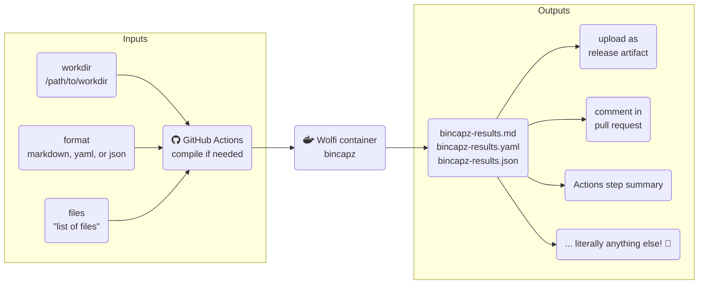

[bincapz](https://github.com/chainguard-dev/bincapz) is an open-source utility that enumerates predicted binary [capabilities](https://man7.org/linux/man-pages/man7/capabilities.7.html) for both compiled and scripting languages (more [here](https://github.com/chainguard-dev/bincapz#features)).  Even before the recent problems with the [xz](https://boehs.org/node/everything-i-know-about-the-xz-backdoor) compression library ([CVE-2024-3094](https://nvd.nist.gov/vuln/detail/CVE-2024-3094)), it's a fast and insightful check to run automatically in a pull request to **highlight any changes** in what a program can be expected to do.

{: .shadow .rounded-10 .w-75 .light}
{: .shadow .rounded-10 .w-75 .dark}
_🤖 hey human, you should take a look at this_

It occupies a difficult-to-cover "middle ground" between static analysis and a full malware detection suite.  Perhaps it could catch subterfuge or malicious inside behavior, but it's just as likely to catch unintended consequences of a code change.  Both are important to call out during a code review.

The problem is `bincapz` is not easy to integrate into GitHub Actions, where a lot of open source development takes place.  Let's fix that!

> Here's the project! [some-natalie/bincapz-action](https://github.com/some-natalie/bincapz-action)  
{: .prompt-info}

## Building the Action

The `bincapz` tool, and all dependencies, are already compiled available in the package repos for [Wolfi](https://github.com/wolfi-dev/), so a simple `apk add` for a few packages gets us most of the way there.  I'd originally attempted to install `yara` and Go, then compile it on each run.  The dependency problems due to the mismatch of Yara versions between what it wants and what's available in Ubuntu Jammy got to be gross.  A pre-built container was the simplest and most portable solution.

The `entrypoint.sh` script gets gnarly with `jq` and `sed` to parse the outputs from each individual file into a unified report for the project.  No additional scripting was needed beyond that.

The code is available in the Actions [repository](https://github.com/some-natalie/bincapz-action) for inspection.

To use it, GitHub Actions will pull the latest pre-built container and run it.  This gives me flexibility from what's available in the managed Ubuntu runners.  As `bincapz` is still under active development, the container is built daily.

## Using it

The idea was that inputs and outputs should be as un-opinionated as possible as a step in a project's CI/CD pipeline.  At a high level, it looks like this:

The inputs are pretty flexible to allow for a variety of use cases:

- `workdir` - the path to the directory to run bincapz in.  It defaults to `${{ github.workspace }}`, but it can change to only look at a subdirectory or to have multiple versions of the code checked out.
- `format` - by default it's a table in `markdown`, but you can also use `yaml` or `json`.  It will output a single file with all results in it.
- `files` - a list of files to check.  Default is all files in the working directory that aren't in `~/.git`.  However, some projects may only want some files so it also supports a string separated by whitespace, like so `files: "./file1 ./dir/file2 ./file3"`.

## Results

It outputs a single file, so what happens from there is up to you!  Here's a few ideas:

- [comment in a PR on changes](https://github.com/some-natalie/bincapz-action/blob/main/examples/compiled-pr-check.yml) - note how you have to checkout and build both the base and head branches to compare the results.
- [upload as a release artifact](https://github.com/some-natalie/bincapz-action/blob/main/examples/release-summary.yml) - keeping a simple record of the capabilities of the project at each version.
- feed the output to another tool, such as software inventory tooling or into release documentation.
- [add a summary to the Actions step](https://github.com/some-natalie/bincapz-action/blob/main/examples/compiled-pr-check.yml#L70-L84)

{: .shadow .rounded-10 .w-100 .light}
{: .shadow .rounded-10 .w-100 .dark}
_sometimes you don't need to keep results forever, just see it for a while_

The results of each run are **not going automatically fail the PR on any changes.**  The goal is only to call attention to capability changes.  Examples of each output type are available here:

- [json](https://github.com/some-natalie/bincapz-action/blob/main/output-samples/bincapz-report.json)
- [markdown](https://github.com/some-natalie/bincapz-action/blob/main/output-samples/bincapz-report.md)
- [yaml](https://github.com/some-natalie/bincapz-action/blob/main/output-samples/bincapz-report.yaml)

> The results format may change due to the upstream project further developing it and/or the repository may move into Chainguard's organization as this matures.
{: .prompt-info}

## Air-gap usage

While the container is rebuilt daily, any individual version should remain effective reasonably long into the future.  Here's what you'll need to pull across:

1. Download the [container](https://github.com/some-natalie/bincapz-action/pkgs/container/bincapz-action) and fling it into your air-gapped environment's OCI-compliant container registry.  Make the image accessible without credentials to download it.
1. Download the [repository](https://github.com/some-natalie/bincapz-action) and fling it into your air-gapped environment's GitHub Enterprise Server installation.  Use [skilled-teleportation](https://github.com/some-natalie/skilled-teleportation) to move other Actions in bulk or use [actions-sync](https://github.com/actions/actions-sync) to do them one-by-one, but make sure to note what organization you're syncing into.
1. Edit your copy of the repository's [action.yml](https://github.com/some-natalie/bincapz-action/blob/main/action.yml) file to point to the image in your container registry instead of the GitHub Packages registry.
1. Cut a new release of your copy, say `v1`. ([docs](https://docs.github.com/en/repositories/releasing-projects-on-github/about-releases))
1. Use it in a workflow as `uses: new-org/bincapz-action@v1` where `new-org` is the organization you synced the repository into.

The runner to use has a few minimum requirements as well.

- A Linux runner with Docker installed and available to run the container.
- The runner will also need everything to compile the code you want to scan _or_ download the artifacts you've already built.
- If using [actions-runner-controller](https://github.com/actions/actions-runner-controller), make sure to use a runner scale set that has [runner-container-hooks](https://github.com/actions/runner-container-hooks/blob/main/packages/k8s/README.md) configured.

---

## Disclosure

I work at Chainguard as a solutions engineer at the time of writing this.  All opinions are my own.
