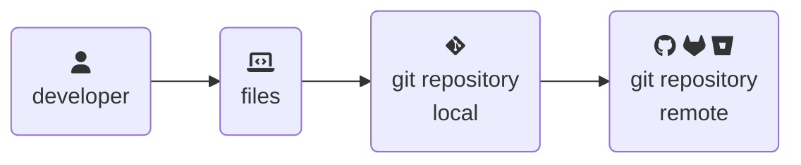

> From [BSides Boulder 2024](https://bsidesboulder.org/), many attempts to figure out **who** did **what**, **when**, **where**, and **why** in a git repository (and some lessons learned, too).  This is an expanded set of slides and resources since shown live on 14 June 2024.
{: .prompt-info}

How do you _know_ what you know about your codebase?

Can it be proven in an audit?  Are you sure about that?

Here's some questions we're trying to answer that I've had to grapple with firsthand:

- "My infrastructure is code."  **How do I prove changes?**
- "There was an incident."  **Were leaked secrets to blame?**
- "We’re making an acquisition."  **Can we even purchase this?**
- "There are foreign nationals on parts of this contract."  **What code are they changing?**
- "Our software factory must carry `compliance certification`."  **How can we get there?**
- "The software is in scope for SOX[^sox]."
- ... and many many more ...

## Where we’re going

- [Intro](#intro) - Hi, I'm Natalie and I'm here to help
- [Biases](#biases) - getting this out of the way up front
- [Threat models](#threat-models) - what problem are we even solving?
- [Git, but really fast](../git-config-audits) - a whirlwind overview of what matters in `~/.git/`
- [Who did this?](../git-identity) - all the ways you can't prove who did what
- [Tips for auditing changes in git](../git-what-changed) - some common ways to not prove what happened and other weird conversations
- **When** - when???
- **Where** - where can we implement controls?
- **Why** - why did this change happen?
- **So what are we to do?** - what can we do about it?
- **No really, why?!?!** are we even here?

This is the process we're going to dive into together. 🛟

## Intro

[Hi, I'm Natalie](../../about).  I do (what's now called) "software factory" things with feds and defense folks, focusing on containerized application security these days.  If any of these alphabet soups mean anything to you, that'll give you a hint of what my work days look like:

- [NIST 800-53](https://csrc.nist.gov/publications/detail/sp/800-53/rev-5/final) and [NIST 800-171](https://csrc.nist.gov/publications/detail/sp/800-171/rev-2/final) and [NIST 800-172](https://csrc.nist.gov/publications/detail/sp/800-172/final)
- [NIST 800-190](https://nvlpubs.nist.gov/nistpubs/specialpublications/nist.sp.800-190.pdf)
- [ITAR](https://www.pmddtc.state.gov/ddtc_public/ddtc_public?id=ddtc_public_portal_itar_landing)
- [CMMC](https://www.acq.osd.mil/cmmc/)
- [FedRAMP](https://www.fedramp.gov/)
- ... probably more I'm forgetting ...

I've been through and helped others through code audits that delve into difficult-to-answer questions about what we can **prove** about a codebase.  These questions about your code repository become increasingly important as the "everything else as code" paradigm is adopted.

If your infrastructure, operations, identity or access controls, and system configurations are code, auditing a git repository is now on the critical path.  These audits can be self-attested or third party, making life harder to plan for at times too.  Here's a ton of ways this has gone poorly for me (or others) in hopes you'll learn from my mistakes. 🫠

## Biases

Experience has given me some ~~heavy baggage to carry~~ _strong assumptions_.

{: .w-50 .shadow .rounded-10 .left }

🌸 **Git is hard.** 🌸

The basics of "stage, commit, push" are easy to learn.  Then add forking or branching, then opening pull (or merge) requests ... now undo a change, or force an update, or resolve conflicts ... the nuances of git are difficult to master.  This is a talk about the implementation weirdness and how it maps to the basics of regulatory controls - proving **who** did **what, when, where,** and **why**.

🌸 **Git is better than anything else.** 🌸

Maybe a lot of that is inertia.  Folks learn git in school these days.  Distributed is normal now, which [wasn't always the case](https://www.joelonsoftware.com/2010/03/17/distributed-version-control-is-here-to-stay-baby/).  Tools like desktop GUIs, IDE integrations, and webapps that host a bunch of peripheral data about your code make life so very much better.

🌸 **Most people don't interact with git from the command line.** 🌸

It shouldn't be necessary in most day-to-day development and that is _okay_.  The cool tools hide a lot of complexity and footguns, letting you focus on the thing you're building.

🌸 **Identity and authorization (IAM) is really hard.** 🌸

Developer tools, regulatory compliance, endpoint management, and IAM are each multi-billion dollar industries.  One could spend an entire career learning any one of these in depth.  We're at the intersection of these, so they're all most likely in scope for an audit.

## Threat models

{: .w-50 .shadow .rounded-10 .right }

For the record, I wrote and submitted this proposal _before_ the whole [xz backdoor](https://en.wikipedia.org/wiki/XZ_Utils_backdoor)[^xzpic] ([CVE-2024-3094](https://nvd.nist.gov/vuln/detail/CVE-2024-3094), [writeup](https://gist.github.com/thesamesam/223949d5a074ebc3dce9ee78baad9e27)) thing happened.  (What's likely to have been) state-sponsored backdoors are an entirely different problem.  Trust goes both ways - no "bad" code goes in (malware), no code leaves (IP threats).  It's a good place to talk about our [threat model](https://www.threatmodelingmanifesto.org/), though.  There are four questions:

1. What are we working on?
2. What can go wrong?
3. What are we going to do about it?
4. Did we do a good enough job?

This time last year, we'd talked about [threat modeling the GitHub Actions ecosystem](../threat-modeling-actions) and how _you_ were the only person who could answer that last question.  Much like Meat Loaf says, "I would do anything for love, but I won't do that." and throughout the entire 8 minute rock opera ballad, he never answers what "that" was.  It was deliberate, so the listener could fill in the blank with their own personal "that."

**There's no ambiguity today** - the auditor or assessor will tell you.

> Up next - what configurations really matter in a git repository?  [Part 2: Configuration matters](../git-config-audits)
{: .prompt-info}

---

## Footnotes

[^sox]: The Sarbanes–Oxley Act of 2002 is a United States federal law that mandates certain practices in financial record keeping and reporting for corporations.  [More from Wikipedia](https://en.wikipedia.org/wiki/Sarbanes%E2%80%93Oxley_Act)
[^xzpic]: That fabulous MS-Paint style drawing of XZ is by [Jerry Bell](https://infosec.exchange/@jerry/112186387514069376)
