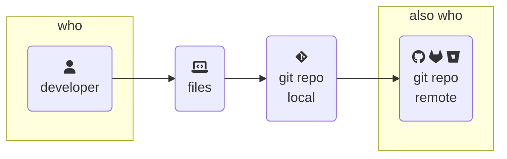
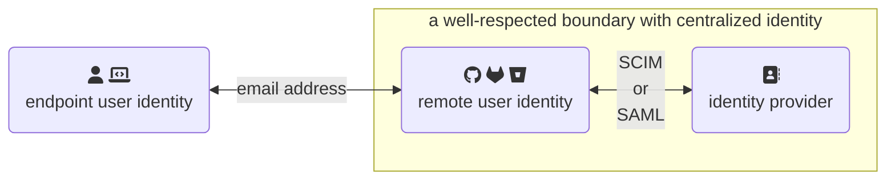
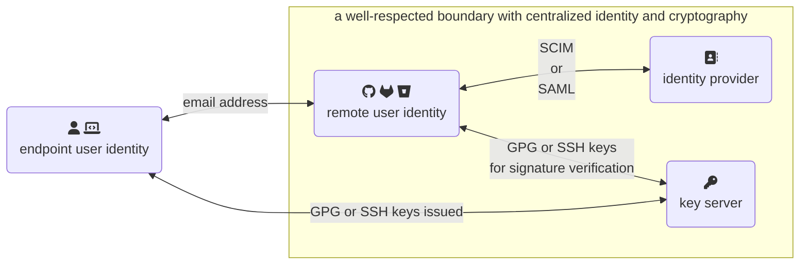

> Can you guess who I am?[^rumplestiltskin] 😈  It turns out distributed identity management is an oxymoron.  Here's what you can know and how to stay sane(ish) through your code audit.  This is an expanded set of slides and resources since shown live on 14 June 2024 at [BSides Boulder 2024](https://bsidesboulder.org/).
>
>🪻 [Overview here, if you missed it!](../git-code-audits) 🪻
{: .prompt-info}

Identity in git and in your central remote are not connected to each other.  **Reliably linking these two completely independent identities can be tricky** in any code audit.  If you take nothing else away from this presentation, let it be this one graphic.



## Who you say you are

Git thinks you are who you say you are.  It can't create a commit without a name and email address to use.  This tiny bit of friction in user experience is so well-known that the major platforms for remote repository hosting[^forge] all prompt you to set this up first.  Here's an example of that "first screen" after creating an empty repo:

{: .shadow .rounded-10 .light }
{: .shadow .rounded-10 .dark }
_literally any remote hosting platform, because git isn't always friendly_

Those magic shell commands update the `~/.gitconfig` file (because of the `--global` flag) with your name and email address.  Here's what that snippet looks like in that file:

```config
[user]
    name = Natalie Somersall
    email = some-natalie@chainguard.dev
```
{: file='~/.git/config'}

... yeah, that's it.

Except it's not.

Remember **all git configuration can vary in scope** between system-wide, per-user (`~/.gitconfig`), or per-repository (`~/.git/config`) with the same order of resolution outlined above.  This is _phenomenally useful_ to users needing multiple identities.  As an example, I use a personal SSH key and my gmail account for open source work on a few repos (local) and OIDC signing with my work identity for my job by default (global).  My name, email address, and signing method are all different between these two identities.

None of this needs a remote hosting platform to work.  It's all built into git.

**It can also change on each commit** because _why not add another dimension to prove identity?_  This means on some level, all of our logs in a git repository are built on individually self-attested data.  Let's make a suspicious commit. 😈

```shell-session
$ git commit -m "just adding some warezzz" --author="Maintainer <not-my-email@gnail.co>"
[main 71010a8] just adding some warezzz
 Author: Maintainer <not-my-email@gnail.co>
 1 file changed, 2 insertions(+), 1 deletion(-)


$ git log --author="Maintainer"
commit 71010a87f84eab30375d0ee80098d597dc8f3d9b (HEAD -> main)
Author: Maintainer <not-my-email@gnail.co>
Date:   Mon Jun 10 16:43:18 2024 -0600

    just adding some warezzz
(END)
```

In the end, all data in `git log` comes from commit data.  So how can we prove _anything_ about this commit?

## Papers, please

Let's see what happens when we push this weird commit to our remote.  Checking the repo's commit history, there's even more silliness going on.

{: .shadow .rounded-10 .light }
{: .shadow .rounded-10 .dark }
_what on earth is going on here?!_

Now we're getting into how git interacts with a remote (repo hosting service, such as GitHub or GitLab) and how that remote interacts with identity.

It appears that `some-natalie` committed a change authored by `Maintainer`.  **It's not uncommon to add authors to commits.**  It's frequently used to pull in work from other remote sources like a different git remote or email patches, sharing credit with others across these gaps.  Apart from the childish commit message, nothing seems wrong here.

But why is it verified?  And who are these users?

## BYOI - bring your own identity

As we've seen so far, identity is messy.  Git necessitates bringing your own identity, which is antithetical to proving who did something.  It is true that `Maintainer` wrote the code and created their commit to the git repository.  However, the credentials that committed and pushed that code to the remote belonged to the `some-natalie` account.

**The account that pushed the code exists on the remote.**  The remote repository hosting service (GitHub, GitLab, etc.) can[^biz] then do neat things such as:

- Be gated by your company VPN infrastructure
- Use single sign-on (SSO) with the company external identity provider
- Control the account lifecycle with SCIM (system for cross-domain identity management)
- Enforce cryptographic signing of code changes with a secondary form of identity - a key!
- Integrate with your audit tooling for logging and alerting
- ... and more I can't remember offhand ...

But as shown in the example above, it doesn't seem to matter as much as would reasonably be assumed.  The reason is why **most regulated industries look similar to this:**



> While it's true that end users may control their **local identity** (who you say you are in git), it shouldn't be possible for them to set their **external identity**[^mischief].
{: .prompt-info}

## Commit signatures

Commit signatures demonstrate that a key signed a particular set of code changes in a tamper-resistant way.  **Commit signatures do not link authorship and identity.**  Please repeat that as many times as necessary.

> Commit signing is _very frequently_ confused as a control to establish authorship of code changes - eg, Natalie's key didn't sign this code, therefore she didn't write it or didn't push it (or any other combination of these).  It's so common that it is one of the first questions I ask a team to determine their maturity at the start of any assessment readiness exercise.
{: .prompt-tip}

Commit signing and signature verification link the remote account that pushed the code owns the key that signed those changes.  In the example above, the commit was pushed to the remote and signed by `some-natalie`, but still authored by `Maintainer`.  **There are three main ways to sign commits.**  Some are easier for users to configure, but all provide the same basic functionality.

### x.509 signing

This lets users sign commits using their issued [x.509 certificates](https://en.m.wikipedia.org/wiki/X.509).  In our use case, it's within your company's [public key infrastructure](https://en.wikipedia.org/wiki/Public_key_infrastructure).  This method also encompasses _decentralized trust_ through user-controlled [GPG keys](https://en.wikipedia.org/wiki/GNU_Privacy_Guard)[^gpgsetup], but that's a topic for another day.  It usually combines something a user has (CAC[^cac], smart card, or other hardware-based key) and something they'll uniquely know (a pin or password to it) to create a tamper-resistant signature on a specific set of changes.

{: .w-75 .shadow .rounded-10 .dark }
{: .w-75 .shadow .rounded-10 .light }
_most git repo hosts will let you append `.gpg` to a user's profile URL to see the public half of their GPG keys for verification_

> If you have private certificates in your company's chain (likely), you'll also likely need to self-host your git server. Most SaaS companies aren't keen to add hundreds/thousands/more random certificate authorities from customers.
{: .prompt-info }

### S/MIME signing

[S/MIME](https://en.wikipedia.org/wiki/S/MIME) is a set of extensions on public-key cryptography for email[^use].  It's a common practice for many organizations to have this infrastructure in place already.  As far as I have seen, S/MIME signing is most commonly used to share trust between disconnected environments that use email patches to move code between them (air-gapped systems).  The same caveats about per-user setup and needing to self-host your server to edit trusted CAs apply here.

### SSH signing

SSH keys can be used _both_ for authentication to (most) git repo hosts and for commit signing.  Some companies have and use infrastructure to manage SSH keys.  It is a similar pattern to x.509 certificate signing above with user setup of git to use these keys.

SSH commit signing what I use on my personal projects as a balance of ease of use and validity.  I generate SSH keys for commit signing and store them on a Yubikey.  It's a balance of getting out of the need to manage and secure local files, but also simple to setup[^sshsetup].

{: .w-75 .shadow .rounded-10 }
_Protip - do not make parody Backstreet Boys lyrics to your auditor **during** the audit._

## Mind the gaps

Going back to our diagram, adding a method to tie code changes made on an endpoint to a centralized identity now looks roughly like this:



What gaps does this model leave that we'll need to account for in our risk register?

### Long-lived secrets

The biggest gap here is pretty well known throughout any other part of IT infrastructure.  Each method of commit signing we outlined use long-lived secrets such as PINs for an x.509 certificate card or an SSH private key file that can be compromised.  This means it should fall under the same scrutiny as other credentials that can be phished or written on post-it notes in the office.

### Time-based validity

It can be difficult to validate if a commit made with a valid-at-the-time-and-not-anymore signature was legit.  As an example, when the commit below was made, I was employed at GitHub and this was signed with a valid key associated to my `@github.com` email address:

{: .shadow .rounded-10 .light }
{: .shadow .rounded-10 .dark }
_a commit signed with a key that is now expired_

That identity existed as a condition of my employment there.  Since I no longer work there, I removed that email and key from my account.  It's now "unverified" even if it was true at the time.  Checking for "unverified now, but was valid at the time" isn't built in to repository hosting platforms.  This means we now need to drag another system or two into our scope to prove that the key was valid and the user was able to use it at the time of the commit.

This condition needs to be accounted for when users control their identity independent of employment.  It may also occur depending on the platform if accounts are deactivated or removed as needed by policy - check the documentation for all the parts at play.

> The best action here is to run an exercise to create an account on your platform, create/sign/push code with a key from the same PKI system to that account, then remove the account following your written offboarding procedures - documenting the user lifecycle with screenshots and any other evidence needed.  There are so many systems and configurations in scope for this that it's hard to provide a universal answer.
{: .prompt-tip}

### Bot use and abuse

Deeply understand (and have evidence to back up) **the entire lifecycle of the myriad of non-user based authentication methods major repository platforms use**.  Quite often, enterprise administrators cannot entirely lock down or audit these easily.  Offhand, these include:

- Service accounts
- OAuth applications
- CI/CD accounts (sometimes treated separately, some can read/write and others read-only)
- Deploy keys (SSH keys tied to an individual repository and not users)
- User-owned credentials that exist outside of an identity provider (eg, an extra SSH key or API tokens)
- ... more I might be missing ...

**These accounts are often overlooked** until it's brought up in an audit.  Without the tools to prove account usage and lifecycle, you're left to other controls for mitigation.  While other controls are sometimes acceptable (and if you're really lucky), it requires yet more documentation on their implementation, mitigation, and any additional workarounds.

> Doing this for CMMC for thousands of users across a mature self-hosted product was **many entangled discussions with lots of service owners and assessors**, pages upon pages of mitigating control documentation, and DIY code written to actually get the job done and map it to the relevant controls.  Perhaps it'll be another post one day.
{: .prompt-info}

As an example for how these bot integration identities can be abused, look no further than the best bot on GitHub - the real [Dependabot](https://docs.github.com/en/code-security/dependabot) always signs commits in GitHub.com with GitHub keys.  Malicious impersonation, such as what [Checkmarx discovered](https://checkmarx.com/blog/surprise-when-dependabot-contributes-malicious-code/) in September 2023, is harder to pull off without checking for signed commits ([example commit](https://github.com/Highpolar-Softwares/I-help-privacy-policy/commit/546584029b38388877b53cc8ef578033dff5001d?diff=unified)).

{: .w-75 .shadow .rounded-10 .dark }
{: .w-75 .shadow .rounded-10 .light }

## The future is bright

Despite all the weirdness we just went over, it's possible to build a robust system of auditing and allowances for maximum developer-friendly features _without_ hating everything about life when your audit comes up.  **The future of identity and signature verification looks bright.**

Using OpenID Connect (OIDC) allows a company to federate _both_ authentication to push code and identity of commit signatures on an endpoint to a central identity provider.  This is still new enough that there's a few methods that folks are trying out.  I'm not aware of a large deployment or Authority to Operate (ATO) using this yet, but if I'm wrong, please reach out.

It significantly narrows the window of time a credential could be misused _and_ ties into a central identity (eg, google or aad or whatever) - remember how I said I can't really prove I wrote it, only that my key signed it.  If I'm limited to OIDC, the window of time I have to do any mischief is meaningfully constrained - usually 5 minutes or less.

### What's OIDC again?

OIDC ([in plain English](https://openid.net/developers/how-connect-works/)) is a way to consume scoped identities without being an IAM provider.  It's actually quite difficult to write a username/password or other way to authenticate securely to an application - not only do you need to store sensitive data (at least a password), but that system needs maintenance, is user-facing target for abuse/exploitation/shenanigans, and doesn't directly bring the company any money.  **It's easier to consume identity securely from someone who does it well instead.**  Here's an example where you can use Google, GitHub, GitLab, or another identity provider to use an application:

{: .w-25 .shadow .rounded-10 .dark }
{: .w-25 .shadow .rounded-10 .light }

### Tricky bits of OIDC

First, not every git repo hosting service supports using OIDC for logging in.  There are ever-changing conditions on which providers are supported by which vendors and what features work on their platform in this configuration.  All of that is way out of scope for anything I'd want to talk about today.  Just know that support seems to be expanding across the board.

Next, after setting up [gitsign](https://docs.sigstore.dev/signing/gitsign/) to sign your git commits, the lack of support from repository hosting services can lead to a weird situation.  I can sign a commit and check it after the fact (in this case, with a GitHub Action), but that green pill-box in the UI to say my commit is "verified" won't work.  If you sign with one of the supported things (SSH, x.509, etc.), this commit will fail the check but show up as verified.

{: .w-75 .shadow .rounded-10 .dark }
{: .w-75 .shadow .rounded-10 .light }
_signed with OIDC, but appears unverified_

{: .w-75 .shadow .rounded-10 .dark }
{: .w-75 .shadow .rounded-10 .light }
_commit not signed with OIDC, but appears verified with SSH_

This discrepancy in expected behavior could be resolved by the repo hosting vendor allowing checks to the public instance of sigstore.  It'd be even better as an arbitrary source for this data - allowing companies to BYO certificate infrastructure the same way they're used to for self-hosted services.  In order to provide that log of verification, it'd be a simple script wrapping [cosign](https://docs.sigstore.dev/verifying/inspecting/) to check each signature against the transparency log.

## Edge cases to note

### Name squatting

Name squatting is when someone else claims an email address or username for another person.  It can be a concern on "free for all" or public services, such as [this example](https://github.com/torvalds/linux/tree/5895e21f3c744ed9829e3afe9691e3eb1b1932ae#linux-kernel) on GitHub.com.  However, it's normally not a concern worth noting in self-hosted infrastructure.  These systems are trivial to gate account creation with an identity provider such as Active Directory[^entra], Okta, etc.

### Mailmap files

These files, stored in the project's root directory as `.mailmap` by convention, simply map multiple emails to one name.  Here's an example:

```config
Bob Smith <bob.smith@company.com> Bob Smith <bob_smith@us.company.com>
Alice Jones <alice.jones@company.com> Alice Jones <alice_jones@us.company.com>
```

It's useful for tracking multiple emails from one human being.  This file is version controlled within the repository and has a well-defined format.  The [documentation](https://git-scm.com/docs/gitmailmap) is quite good as well.  The support is built in to git, but not the repository hosting services.  I've never had them come up in an assessment, personally, as I have only seen these controls met by using an identity provider that's used by the repo hosting service.

## Parting thoughts

{: .shadow .rounded-10 }

> "During this sprint, one of you will merge complete garbage" ... but do you know who?  😈

That was a lot.  It also feels like we've only scratched the surface of "hard to prove identity problems in git repos that I've had to answer for".  To summarize:

1. Git requires you bring your own identity.  This is hard to do anything with.
1. Basically every remote repository hosting service can hook into your identity provider.  Do this.
1. Commit signing doesn't prove authorship.
1. There's a bunch of weird edge cases, cool new technologies to make this better, and even more nuances with your platform/integrations/setups than possible to document.
1. It's all really hard - IAM, git, endpoint management, certificate management, software ... it's okay to just live with that.

> Identity is hard, so let's change the pace and look at what git is 🌟 phenomenally good at 🌟 - tracking changes in files!
>
> 🕵️‍♀️ **Next up** - tips, tricks, and footguns to watch out for when looking at _what changed_ in a repository.  [Part 4: Tips for auditing changes in git](../git-what-changed)
{: .prompt-info}

---

## Footnotes

[^rumplestiltskin]: [Rumpelstiltskin](https://en.wikipedia.org/wiki/Rumpelstiltskin), as interpreted as a developer by AI.
[^mischief]: If a user can mess with their identity in your identity provider, there are much bigger problems to worry about than source code audits.
[^cac]: Common Access Card, which is what those smart cards are called within and around the US Federal market.  It's an identity card with many features on it, but most importantly, cryptographic certificate(s) on a chip.
[^biz]: These are normally features gated behind paying for an "enterprise" or "business" plan 💰
[^sshsetup]: SSH commit signing this way requires setting up git to use it and your remote host to trust it.  The best directions here are [a fantastic workshop from Git Merge](https://youtu.be/uhy_ojFqLg0) a few years back by the ✨ amazing ✨ [Andy Feller](https://github.com/andyfeller).  To store the key on a Yubikey, I used these excellent [directions](https://xeiaso.net/blog/yubikey-ssh-key-storage/) from the incomparable [Xe Iaso](https://xeiaso.net).
[^gpgsetup]:  The best GPG introduction and setup guide I've found is from [Ian Atkinson](https://ianatkinson.net/computing/gnupg.htm).
[^use]: "Encrypt this email" type functionality that uses the account provided to you by your company likely uses S/MIME under the hood to encrypt and decrypt messages only for the specified recipients.  It's not terribly friendly to set up, but it's simple to use once an IT department sets it up for everyone.
[^entra]: As of writing, Microsoft's "Active Directory" product is called multiple things depending on your deployment model.  Right now, the SaaS version is called "Entra" and the only people using that name work at Microsoft still so ... everyone knows what Active Directory is still.  Don't get pedantic, it'll likely get rebranded again soon.
[^forge]: Remote repository hosting (eg, GitHub, GitLab, BitBucket, etc.) sometimes get called "git forges" or "code forges".  I hate this term for reasons I will rant about later.  These patterns of identity in an audit are not limited to git, each of these platforms have their own nuances and interactions with other parts of your infrastructure, and in conversation, we'll end up just using the brand name of whatever you're using - eg, back to "GitHub/GitLab/whatever".
