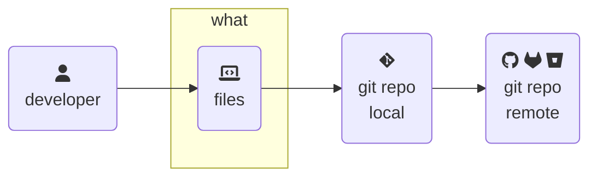

> From [BSides Boulder 2024](https://bsidesboulder.org/), tracking what changed is the one thing that git is designed to do and it does that task ✨ phenomenally well. ✨  Here's a few hard-earned **tips to make common awkward questions easier to answer**.  This is an expanded set of slides and resources since shown live on 14 June 2024.
>
>🪻 [Overview and contents here, if you missed it!](../git-code-audits) 🪻
{: .prompt-info}



## Large files are weird

Git is awful at _directly_ storing large files.  It's not what it was designed to do.  To address this, there's a [large file storage](https://git-lfs.com/) (`git lfs`) extension.  It's phenomenally good at storing large files, _buuuuuut_ it's because they're not stored in the repository as such.  Instead, it uses a pointer to the big file in the repository.  The actual big file is stored in a big unstructured "bucket".  Architecturally, it looks like this:

{: .w-75 .shadow .rounded-10 }
_how git-lfs works, from the [official website](https://git-lfs.com/)_

To accomplish this, git-lfs uses two hooks (more on hooks later) to filter files and redirect them to large file storage and rewrite that pointer file[^spec].  Once set up, this process is completely invisible to the user.  The file that defines this behavior is `~/.gitattributes` and gets version-controlled within the repository, so any changes to this configuration are logged.

The `clean` and `smudge` events filter these files as they move from working (head) to staging, updating the pointer file and creating a new large file stored on the remote as needed.  Using the diagram above, `clean` is the filter from working to staging (straight vertical arrow) and `smudge` goes from staging to working (curved arrow).

This plain text pointer is what changes and gets version-controlled in your git repo.  Here's an example of those pointer files:

```plaintext
version https://git-lfs.github.com/spec/v1
oid sha256:4d7a214614ab2935c943f9e0ff69d22eadbb8f32b1258daaa5e2ca24d17e2393
size 12345
```
{: file='pointer file for a version of a large file stored with git-lfs' }

There are two data points about this large file that must match - the `sha265` sum and the size of the file in bytes.  It is beyond mathematically unlikely for two files to share `sha256` sums (approx 1 in 2^256 or 1.16*10^77 or many many times more than there are grains of sand on earth), so untracked changes are quite unlikely.  Then add in that the duplicate must also have the same byte size.  **It's exceptionally difficult to attempt undetected LFS file modification compared to compromising another system instead.**

The threat model for compromising anything via git-lfs is much more skewed towards the contents of those files, which is a great endpoint management problem solved using well-known tools like anti-malware and endpoint detection software.  In my experience, talking through this system gets _gross_ - scripts that want to perform full anti-malware scans, intercept files and quarantine them, etc.  For the most part, this can’t happen quickly enough so can then break your self-hosted systems.

> **If big files are in your audit scope**, plan for central file-system control mechanisms up front _only_ if reactive change tracking and endpoint controls aren't acceptable.
{: .prompt-tip}

## Rewriting history

{: .w-50 .shadow .rounded-10 .left }

Sadly, no talk about git repositories is complete without a reminder to please stop putting secret things inside of it.  This is also true of removing large files or placing them into git-lfs.  Let's talk about the audit implications of cleaning up a spill.

The usual guidance for cleaning up involve rewriting history to remove that data, then force-pushing to the central remote to clean it up.  **This rewrites history!**  The other path is to remove that sensitive data from the current state of the code, then **remove all history of that codebase.** 😱

Neither of these options guarantee that the code pushed to a central remote hasn't been cloned to other servers or endpoints that have access to that repository, then who knows what from there.  It's a giant mess to try to trace and quickly becomes impossible to prove.

> **History isn't immutable** if it can be rewritten or removed in an attempt to clean up a data spill. 🦉
{: .prompt-warning}

**Don't revise history to clean up spilled secrets.**  They're already compromised.  Invalidate and rotate them to new ones, then live with the history of now-invalidated credentials.  This has the advantage of keeping a history of what was leaked, when, and by who - making incident response and targeted education efforts easier.  It's much simpler to not have rewritten or removed the history of changes than it is to explain and prove that was the only thing that ever changed.

There are the occasions where history must be sacrificed to clean up data.  In these cases, here's a few "provability" points that have helped me.

1. **Be obvious!**  Use a super transparent commit message like `"FORCE PUSH to <do thing> - see [ISSUE-xxx] for details"`.  This also means another system (like a ticket system) contains an independent record of this event and any approvers needed.
2. If it’s removing large files for an LFS migration, consider using `~/.git-blame-ignore-revs` to quiet down `git blame` to a reasonable amount.  The history of this massive commit changing lots of things will still exist, but it will make it less noisy for the folks working in this code base day after day.
3. **Block force-pushing by default** so that unblocking them in your centralized remote fires off lots of alarms in your SIEM if it does happen.[^noteverywhere]

All of these are assuming features common on enterprise _self-hosted_ remote platforms, but may not be available on SaaS platforms[^hooks].  And again, even after the remote repo is cleaned up, the entire problem of where those secrets have gone from there still needs to be addressed.

## Diffs and patches

Patches and diffs are not the same thing - even if they're really similar.  **A patch is a diff with more infomation about itself**, such as the parent commit, author, and commit body.  Here's an example `patch`, with the metadata up front and the `diff` (a one line change) below:


```diff
From 04ac517113cd2205427e4484bc624d21200db065 Mon Sep 17 00:00:00 2001
From: Natalie Somersall <some-natalie@chainguard.dev>
Date: Thu, 20 Jun 2024 19:31:41 -0600
Subject: [PATCH] remove `load:true`

---
 .github/workflows/build-latest.yml | 1 -
 1 file changed, 1 deletion(-)

diff --git a/.github/workflows/build-latest.yml b/.github/workflows/build-latest.yml
index d922018..5347180 100644
--- a/.github/workflows/build-latest.yml
+++ b/.github/workflows/build-latest.yml
@@ -43,7 +43,6 @@ jobs:
         with:
           file: ./images/${{ matrix.os }}.Dockerfile
           push: true
-          load: true
           platforms: linux/${{ matrix.arch }}
           tags: |
             ghcr.io/${{ github.repository }}/${{ matrix.os }}:latest
```
{: file='example patch file' }


These are simple enough to generate with only git, but remote repository hosts make the process to generate these very easy - add `.patch` or `.diff` to a commit URL to generate it for you in plain text.  **This makes scripting that may need to do for reporting simpler** when you're pulling from that central source of truth instead of what's local or distributed throughout a bunch of endpoints.

> Git is great at tracking changes in files, but only if the people and processes are equally great at not rewriting history or any other funny business.
>
> 🕵️‍♀️ **Next up** - How does git understand time?  What can we prove about when a change occurred?
{: .prompt-info}

---

## Footnotes

[^spec]: [git-lfs specifications](https://github.com/git-lfs/git-lfs/blob/main/docs/spec.md) to learn everything about how it's implemented.
[^noteverywhere]: Do this only for your repos in scope and their dependencies.  It's really annoying and can drive shadow IT usage if it's preventing out-of-scope things like prototyping or personal preference repos (such as [dotfiles](https://dotfiles.github.io/)).
[^hooks]: It's also possible to attempt a detection of force pushes that overwrite history using a pre-receive hook.  Here's two examples - [force_push_restricted_branches.sh](https://github.com/github/platform-samples/blob/master/pre-receive-hooks/force_push_restricted_branches.sh) and [detect-force-update](https://github.com/kyanny/git-hooks-detect-force-update).
