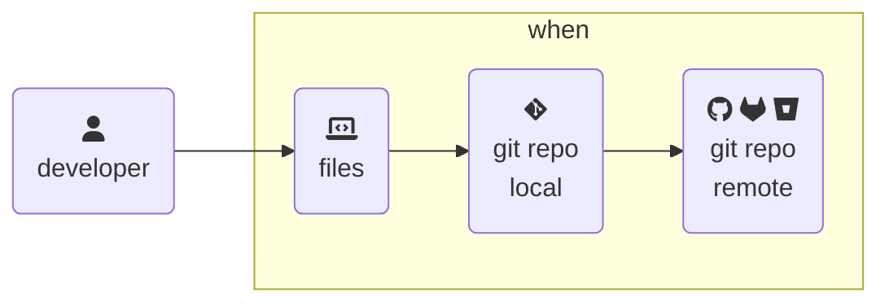

> From [BSides Boulder 2024](https://bsidesboulder.org/), time is meaningless and other terrible misunderstandings.  This is an expanded set of slides and resources since shown live on 14 June 2024.  
>
>🪻 [Overview and contents here, if you missed it!](../git-code-audits) 🪻
{: .prompt-info}



<div style="text-align:center"><p style="font-size: 20px"><b>
Time doesn't matter in git - only order of operations. 🙃
</b></p></div>

## How git sees time

There are two dates to know - author and commit date.  The author date is when `git commit` is run.  The commit date can also account for a rebase, force push, or amendment to the commit.  The first is usually tied to users and the second to the repository.  **These are set locally, usually equal to the system's time.**

Depending on the team workflow, a discrepancy may be a good way to signal further investigation, right?

```shell-session
$ git add assets/graphics/2024-06-14-whodunnit-git-repo/gitfiti.png
$ git commit -m 'backdate files by a week' --date=format:relative:1.week.ago
[main e0f17ed] backdate files by a week
 Date: Sun Jun 23 18:23:22 2024 -0600
 1 file changed, 0 insertions(+), 0 deletions(-)
 create mode 100644 assets/graphics/2024-06-14-whodunnit-git-repo/gitfiti.png
```
{: file='editing only the author date'}

Not exactly ... as shown above, there's simple ways to set this manually and you may want or need to.  For example, if you're moving commits manually between repositories or backdate work for timekeeping reasons, it's simple to do.  You can also set both manually, as shown below.

```shell-session
$ git add assets/graphics/2024-06-14-whodunnit-git-repo/squash-merge-evangelist.jpg
$ GIT_AUTHOR_DATE='2020-02-19 15:34:40 -0600' \
  GIT_COMMITTER_DATE='2020-02-19 15:34:40 -0600' \
  git commit -m '2020 commit example'

[main dcea567] 2020 commit example
 1 file changed, 0 insertions(+), 0 deletions(-)
 create mode 100644 assets/graphics/2024-06-14-whodunnit-git-repo/squash-merge-evangelist.jpg
```
{: file='setting both dates manually'}

However, the parentage of comments (read "order of operations") remains the same, as shown in the three commits below:

```plaintext
commit dcea567a4f2d882c28e2424f54c9e0cbf86ef3a6 (HEAD -> main, origin/main, origin/HEAD)
Author: Natalie Somersall <some-natalie@chainguard.dev>
Date:   Wed Feb 19 15:34:40 2020 -0600

    2020 commit example

commit e0f17ed6f625b6126a67184eff2650728a752925
Author: Natalie Somersall <some-natalie@chainguard.dev>
Date:   Sun Jun 23 18:23:22 2024 -0600

    backdate files by a week

commit 109ff5564e36d357e5ad316d16486e031c4a2a02
Author: Natalie Somersall <some-natalie@chainguard.dev>
Date:   Sat Jun 29 13:45:03 2024 -0600

    switch to "removesuffix" over "strip"
```
{: file='commit history, showing most recent first despite timestamps saying otherwise'}

While it remains tricky to adequately alter history, this is still set by users on endpoints without any controls and independently of the endpoint's system time.  I wouldn't want to attempt using it to prove anything about when a change was made. 🍀

> Once **the meaninglessness of time is established**, auditing code changes in a repository becomes much simpler.  Centralized infrastructure for hosting repositories, deploying code or artifacts, and other tasks can act as a timekeeper if necessary - connecting to a company NTP server, monitoring when changes are received (versus made locally), and what processes happen after that.
{: .prompt-tip }

## Make me a rockstar

The irrelevance of time in git, plus a prominent graph to show your activity, means you can do fun things with it - like drawing!  GitHub, GitLab, etc. use <this one> to make those neat contribution graphs.

{: .w-75 .shadow .rounded-10 }
_image courtesy of [gelstudios/gitfiti: abusing github commit history for the lulz](https://github.com/gelstudios/gitfiti)_

It's also got some less silly uses, such as [jasonk/contrib-sync](https://github.com/jasonk/contrib-sync), which uses the same principles to **map commit activity in private git servers for work to your public profile** on GitHub.com[^connect].  This allows a user to show a pretty green graph as a profile, receiving credit for authorship while never sharing code.

This makes using git to generate productivity metrics difficult, too.  Convincingly random data with [avinassh/rockstar: Makes you a Rockstar C++ Programmer in 2 minutes](https://github.com/avinassh/rockstar) is straightforward to generate, further manipulating this data.  This makes even "how many commits are devs making" an even more useless metric - but helpful if it is believed to somehow influence performance reviews. 👿

## Git's logging is still handy

All of this is not meant to say that git's logging is useless, only that it should be cautiously trusted.  Here's how I've used it in the past to answer questions about a repository's history.

### Filtering to search

```shell-session
$ git log --pretty=format: --name-only \
    --since='1 year ago' --until='now' |\
    sort |\
    uniq -c |\
    sort --reverse |\
    head -5

  93
  24 images/rootless-ubuntu-jammy.Dockerfile
  21 images/ubi9.Dockerfile
  21 images/ubi8.Dockerfile
  19 .github/workflows/build-release.yml
```
{: file='most changed files in the last year'}

`git log` has a few nifty filters built in.

- `--since=<date>` and `--until=<date>` to scope searches by time.  You can use one or both, so long as the time is in a format git understands.
- `--author=<name>` to filter by author.  This is useful if you're looking for a specific person's changes.
- `--grep=<pattern>` to search commit messages for a specific string.  This is useful if you're looking for a specific change.

### Make pretty graphs

It can even create history graphs, formatted however you'd like.

```shell
git log --graph \
  --pretty=format:'%Cred%h%Creset -%C(yellow)%d%Creset %Cblue%cn%Creset committed %s %Cgreen(%cr)%Creset' \
  --abbrev-commit \
  --date=relative
```
{: file='a pretty git log'}

{: .shadow .rounded-10 .w-75}

### I just want a CSV file

[git log to csv](https://github.com/some-natalie/gitlog-to-csv) is perhaps my most shamefully pedantic use of git.  It iteratively creates a CSV over each commit on a branch, then prints some basic information about the amount of changes and whether or not the commits are signed with a trusted signature.  This amounts to a "chain of custody" report many auditors are used to - even if all the data is in the git repo and it's just reconfigured to be shoved in a spreadsheet.

## Single source of truth

A single source of truth is our centralized repository hosting service.  It can hook into NTP, monitor time drift, and many can provide information about when it received a change instead of relying on self-reported time on an endpoint.  Use that.

> Time, like identity, is something git users control on endpoints.  Don't rely on it.
>
> 🕵️‍♀️ **Next up** - given the decentralization, what can git do for us?  Where can controls or checks reliably be set?
{: .prompt-info }

---

## Footnotes

[^connect]: GitHub Connect can _technically_ do this, called [unified contributions](https://docs.github.com/en/enterprise-server@latest/admin/configuring-settings/configuring-github-connect/enabling-unified-contributions-for-your-enterprise).  In all of my years on their customer advisory board and working there, I'm convinced _exactly no one_ enables this feature.  It requires a company to connect theirs server to the internet (_uncommon_), encourage linking a personal non-work-owned identity to a work one (_quite rare_), and then have a user actually do it (_even rarer_).
