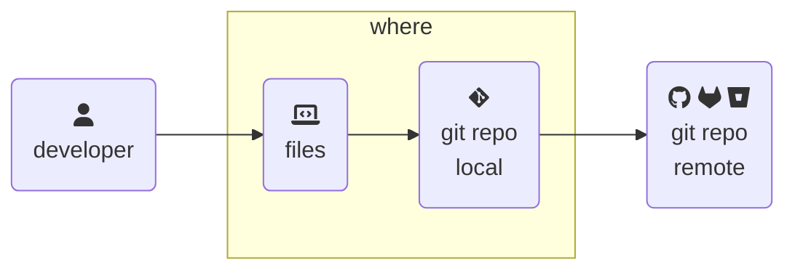
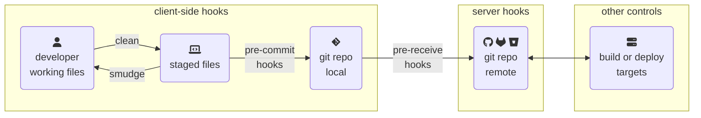

> From [BSides Boulder 2024](https://bsidesboulder.org/), locations of fun - where controls can be reliably set, where they can be bypassed, and where secrets can be stored too.  This is an expanded set of slides and resources since shown live on 14 June 2024.
>
>🪻 [Overview and contents here, if you missed it!](../git-code-audits) 🪻
{: .prompt-info}



## Check it out

One of the best, most efficient, and horrifyingly difficult to explain in an audit concept of git is how [`git checkout`](https://git-scm.com/docs/git-checkout) can do a bunch of (seemingly) unrelated things.

- Want to create a new branch?  `git checkout`
- What about check out an existing branch?  `git checkout`
- Want to see what's going on in a remote's copy of a branch?  `git checkout` (but you'll also need to remember to fetch changes ...)
- What about go back in time to create a new branch from a different state of the repository?  `git checkout`
- You can also use `git checkout` to check out a single file from a different branch, or even a different commit.  This is a handy way to see what a file looked like at a specific point in time, or to copy a file from a different branch without changing branches.

Here's an example, using a commit SHA and filename we'll see again soon:

```shell-session
$ git checkout 53f7754 -- test.sh

$ git status
On branch main
Changes to be committed:
  (use "git restore --staged <file>..." to unstage)
  modified:   test.sh

$ git add test.sh

$ git diff --cached test.sh
```

Now we'll see the changes from the last commit to the current working state (as checked out in the past) by using `git diff --cached`.  This is where we broke a script, but no changes made to any other files that have definitely changed since then.

```diff
diff --git a/test.sh b/test.sh
index 5a5e69a..5913ee8 100755
--- a/test.sh
+++ b/test.sh
@@ -1,3 +1,3 @@
 #!/bin/bash

-echo "now let's break it" && exit 1
+echo "Hello world" && exit 0
```

All of this hard-to-explain nonsense is because underneath the hood, **git is built on pointers.**

## Pointers all the way down

[Pointers](https://en.wikipedia.org/wiki/Pointer_(computer_programming)) are [notoriously difficult](https://www.joelonsoftware.com/2005/12/29/the-perils-of-javaschools-2/) for developers to understand.  This [long closed question on StackOverflow](https://stackoverflow.com/questions/4025768/what-do-people-find-difficult-about-c-pointers) has a lot of opinions on why.  While there's tons of 🌶️ spicy takes 🌶️ about that, it remains true that **pointers aren't something that can be expected for all auditors to understand.**

> The way I tend to explain this to auditors is that `git checkout` says:
>
> "Convert this repository to the state that `branch` or `commit` or `tag` points to."
>
> Then, _never, ever, **EVER**_ rely on an auditor to understand pointers or the state of a repository at any point in time to meet any control.
{: .prompt-tip }

I see this come up most frequently on any configuration or infrastructure as code tooling.  The tool itself doesn't matter, but the concept of how the "declared state" in git reaches and is applied by the tool at any point in time is critical.  This means any instance of `git checkout` to any of these tools has me double checking for _either_ of these:

1. **Using the latest commit on a protected branch** - Sometimes acceptable to your auditors, but simplifies maintaining your security posture by relying on your central git server's controls.
1. **Exclusively checking out a specific commit to apply** - The simplest way to make sure you're using the same code each and every time, as **tags and branches are mutable.**  The downside is this complicates the workflow to update the configuration by a little bit to update both the configuration repository and the tooling to look at that new commit.

**Pinning to a commit is easier to explain.**

## Hook execution



Another frequently used and misunderstood part of git is attempting to use hooks for auditing.  [Git hooks](https://git-scm.com/book/en/v2/Customizing-Git-Git-Hooks) are scripts (usually shell scripts, but can be anything) that can run on dozens of possible events.  They're stored in `.git/hooks/EVENT`, meaning they're not version-controlled by the repository itself.

Broadly speaking, these are _either_ run locally (client-side) or on the remote (server-side).

While it isn't technically a hook, the first place to "do a thing on event" is a filter that can do simple operations when moving from working to staging (`clean`) or vice versa (`smudge`).  I've found these useful for simple tasks like removing trailing whitespace, adding/removing a sensitive string, or normalizing line endings (eg, `CRLF` to `LF`).  [Clean and smudge filters](https://git-scm.com/docs/gitattributes) are set in the `.gitattributes` file, so it gets version-controlled by the repository _and_ runs locally across any developer endpoint.  However, because of both the danger this presents to untrusted code/people/systems and the unreliability of endpoint configuration, it's somewhat limited in being helpful for compliance.

{: .w-50 .shadow .rounded-10 .right }

**Client-side hooks are powerful tools to do something on an event**, but they're limited in their ability to enforce due to having to be configured on every endpoint without being version-controlled by the repository.  This makes them difficult to prove for universal compliance to a given workflow.  The most common hooks here are **pre-commit**, catching things as they move from staging to a commit.  There are many great uses outlined by the [pre-commit project](https://pre-commit.com/) ([GitHub](https://github.com/pre-commit/pre-commit-hooks)), such as preventing secrets from getting committed or enforcing a code style.

However, these come with the ability to bypass them at any time too, using the `--no-verify` flag.

```shell-session
$ git commit --no-verify -m "adding a little password here, nothing to see"
[main da015bc] adding a little password here, nothing to see
 1 file changed, 1 insertion(+), 1 deletion(-)
```

**Server-side hooks are more powerful for auditing**, as you can control the code, execution environment, and enforcement across any number of developers and endpoints.  The most common place to run server-side hooks is before the pushed code is accepted by the server - a `pre-receive` hook.  Many examples can be found in this [GitHub repo](https://github.com/github/platform-samples/blob/master/pre-receive-hooks/README.md) to enforce policies like:

- [Prevent self-merging your own code](https://github.com/github/platform-samples/blob/master/pre-receive-hooks/block_self_merge_prs.sh)
- [Require a JIRA issue key in the commit message](https://github.com/github/platform-samples/blob/master/pre-receive-hooks/require-jira-issue.sh)
- [Block unsigned commits](https://github.com/github/platform-samples/blob/master/pre-receive-hooks/block_unsigned_commits.sh)
- [Prevent certain file extensions](https://github.com/github/platform-samples/blob/master/pre-receive-hooks/block_file_extensions.sh)

While robust and simple to configure and prove, pre-receive hooks are less popular due to the use of co-tenanted SaaS products.  For both security and platform reliability, these companies don't allow arbitrary script execution from end users.  This is less of a concern in an enterprise environment with a self-hosted git server, as these will allow server-side hooks configured by a system administrator.

## Improving controls after a lapse

Oh no!  There's been code accepted that should have been reviewed more thoroughly.  While it passed the controls we can put in place elsewhere (eg, in our build systems or central git repositories), now we must look into git to dig deeper to improve our controls.  This lets us figure out **where in that order of operations something went wrong so that we can implement better controls** - a new pre-receive hook or another CI test, for example.  Apart from the standard advice of looking through logging systems and the like, there's not much written about using git for this.  Here's how I've survived several incident post-mortems to improve compliance controls.

The first tool I reach for is an **amazingly nifty command called `git bisect`.**  It's a binary search between two points in time to find out where something broke.  You tell it a known good commit (or tag) and a known bad commit (or tag), and it will check out a commit somewhere in the middle.  From here, do any testing needed to then tell git if it was good or bad.  It will then use that data point to iterate closer and closer to the commit that broke things.  While it's one of those commands you could probably write a book about all the ways to use it, the [documentation is fabulous](https://git-scm.com/docs/git-bisect) and thorough.

One more handy way to find out when and where something broke is to **use `rebase --exec`**.  This lets you execute any arbitrary shell command from a commit in the past then move forward one-by-one until reaching the present state _or_ breaks, as shown below.

```bash
#!/bin/bash
echo "why, hello world!" && exit 0
```
{: file='test.sh' }

I changed this message a few times with a new commit, then changed the exit code to `1` to force a failure.  Let's see where that happened when I tried to test it iteratively from a few commits ago:

```shell-session
$ git rebase --exec ./test.sh 53f7754
Executing: ./test.sh
why, hello world!
Executing: ./test.sh
i'm still working, isn't that neat?
Executing: ./test.sh
now let's break it!
warning: execution failed: ./test.sh
You can fix the problem, and then run

  git rebase --continue

$ bash fix-the-problem-i-guess.sh
```

## Secrets are the worst

In my experience, the most complicated and difficult part of any compliance controls is figuring out where secrets are generated, stored, and used.

**Git tries not to store credentials.**  Instead, it tries to consume secrets stored safely by another program.  The most common place is for it to use the host operating system's built-in store or other third-party store, called a [helper](https://git-scm.com/doc/credential-helpers).  SSH uses an agent to store keys that are written to disk (usually in `~/.ssh/`).  In general, I've not had much problems explaining secure storage of credentials in git, as it's usually inherited by endpoint management.

Much more problematic are **the variety, types, and scope of credentials that can be generated in the central git remote.**  As an example of this, there are many volumes of documentation and nuances about the ways to log in to GitHub.  Offhand, here's what I recall having to include in any audit scope:

- OAuth apps (or GitHub apps)
- Deploy keys _(why can you give these write permissions?)_
- API keys / PATs (classic and fine-grained)
- SSH account keys
- Commit signing keys (SSH, GPG)
- Service accounts
- GITHUB_TOKEN (or similar single-session JIT authentication)
- Webhook configuration and destinations
- ... there's probably more I'm forgetting ...

Yes, it's a problem if any of the above get into a repository.  The bigger problem is in documenting all of the above.  **Determining what credentials exist, the age and scope of each, and who/what owns them can be difficult.**  The difficulty will vary greatly depending on which repository hosting service is in use, how it's configured, and other controls in place such as network restrictions or identity policies.

## Central controls

Your central remote repository is a far more reliable way to set and enforce controls.  Many of the companies that build this have been somewhat receptive to the needs of more regulated industries.  Here's a few of the controls that have been critical to my projects:

1. Gate as many credential-generation options as possible
1. Use pre-receive hooks as best as you can
1. Set branch or tag protections - while immutability isn't built in to git, using this can at least leave an audit trail if anything is bypassed.
1. Leverage the `CODEOWNERS` file to provide ownership to teams over parts of a repository (but it changes, so navigate to it at that point in time too)

This balance point between flexibility and control can vary by project.  That's okay.  Hopefully where to put these controls helps maximize the freedom you can allow your teammates while speeding up building a solid audit packet. 💞

> Controls and settings shift a lot.  Centralizing them into a single source of truth is both helpful and more secure.
>
> 🕵️‍♀️ **Next up** - how to figure out why something changed in the first place? [Part 7: Explaining why a code change happened during an audit](../git-why)
{: .prompt-info }

---

## Resources

- The always fabulous guide to getting yourself out of major weird git problems - [Oh Shit, Git!?!](https://ohshitgit.com/)
- [He who dove too deep into git checkout and git reset](https://inmachineswetrust.com/posts/git-deep-dive-checkout/)
- Some vendor documentation on pre-receive hooks from [GitHub](https://docs.github.com/en/enterprise-server@latest/admin/enforcing-policies/enforcing-policy-with-pre-receive-hooks/managing-pre-receive-hooks-on-your-instance), [GitLab](https://docs.gitlab.com/ee/administration/server_hooks.html), and [GitGuardian](https://docs.gitguardian.com/ggshield-docs/integrations/git-hooks/pre-receive).
