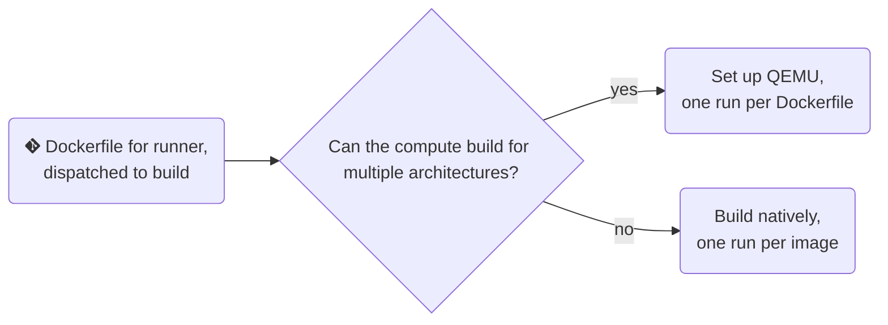

When I'd started out building images for [actions-runner-controller](https://github.com/actions/actions-runner-controller), I'd only built them for `amd64`.  This was fine until I got a new job working with folks on ARM instead.  I still use this project to simulate other container workloads and demonstrate different parts of the software supply chain.  This seems like a simple valuable addition.

> The end goal is to have a single GitHub Actions workflow that will regularly build runner images using multiple CPU architectures.  The [finished workflow](https://github.com/some-natalie/kubernoodles/blob/main/.github/workflows/build-latest.yml), for the impatient. 😇
{: .prompt-info}

I've also been spending less time actively maintaining this project, so anything to make it more automated to simply continue to use somewhat safely.  The priorities here are minimizing upkeep time and staying recent enough to not be horrifyingly insecure.

## Regular builds

The first step is to build the images regularly.  This automatically happens once a week via `cron` scheduling.

```yaml
name: 🍜 Build/publish all runners

on:
  workflow_dispatch: # build on demand
  schedule:
    - cron: "43 6 * * 0" # build every Sunday at 6:43 AM UTC
```
{: file='.github/workflows/build-latest.yml'}

I usually prefer using [semver](https://semver.org/) for versioning my projects, but found it to be a poor fit for this use case.  These images can be stored indefinitely for retention purposes, but they're not meant to be used for long periods of time either.  The build pipelines and such around these images doesn't change substantially, but the images do get rebuilt often to stay up-to-date.

This uses both the short SHA of the commit and `latest` as the tag instead.  It's also not unreasonable to use the date of the build as an image tag in this case.

## Set minimal CI permissions

Next, set the permissions for the just-in-time token to do everything we're asking it to do here _and no more_.  Each permission has a comment to justify itself.

```yaml
jobs:
  build-all:
    runs-on: ubuntu-latest # use the GitHub-hosted runner to build the image
    permissions:
      contents: write # for uploading the SBOM to the release
      packages: write # for uploading the finished container
      security-events: write # for github/codeql-action/upload-sarif to upload SARIF results
      id-token: write # to complete the identity challenge with sigstore/fulcio when running outside of PRs
    strategy:
      matrix:
        os: [rootless-ubuntu-jammy, rootless-ubuntu-numbat, ubi8, ubi9, wolfi]
    continue-on-error: true
```
{: file='.github/workflows/build-latest.yml'}

Each operating system is built in parallel using the `matrix` strategy.  There are currently five operating systems in the matrix, with their names corresponding to the `Dockerfile` in the `~/images` directory.  It's easy to change when needed.

## Boring setup

The initial setup to building is delightfully boring.  In order, we're:

1. Checking out the repository
2. Setting the version of the image to the tag of the release (if it's a release).  This is always skipped in this workflow because it doesn't run on release, but I've left it for reference.
3. Setting the short SHA of the commit for a short, (usually) unique identifier.
4. Logging into the GitHub Container Registry.  Swap in whatever registry the final image gets pushed to when adapted for your own use.


```yaml
    steps:
      - name: Checkout the repo
        uses: actions/checkout@v4

      - name: Set version
        run: echo "VERSION=$(cat ${GITHUB_EVENT_PATH} | jq -r '.release.tag_name')" >> $GITHUB_ENV
        if: github.event_name == 'release'

      - name: Set short SHA
        run: echo "SHA_SHORT=${GITHUB_SHA::7}" >> $GITHUB_ENV

      - name: Login to GitHub Container Registry
        uses: docker/login-action@v3
        with:
          registry: ghcr.io
          username: ${{ github.actor }}
          password: ${{ secrets.GITHUB_TOKEN }}
```
{: file='.github/workflows/build-latest.yml'}


## Multiple CPU architectures

First, one design decision needs to be made.  **Can the compute you're using to build the runner images build for multiple architectures?**

If it can, you can use QEMU to build for multiple architectures.  I'm doing this because this is an open-source project and I'm using free compute from GitHub Actions to build these containers.  This can come at a performance penalty - emulation takes a lot longer to do.

If your compute can't do this or build time is important, you'll need to build natively for each architecture.  I would recommend using a separate job for each architecture to account both for a different runner type and to handle any platform-specific quirks without clever YAML templating - e.g., `build-all` (producing 10 images, 5 runs with 2 images each) becomes `build-aarch64` and `build-amd64` (5 runs for each job, making 1 image each run).  You'll then be able to bypass this step.



In the YAML workflow, define the platforms.  In our case, it's `linux/amd64` and `linux/arm64`.  Literally any other QEMU-supported platform can be added here.

```yaml
      - name: Set up QEMU
        uses: docker/setup-qemu-action@v3
        with:
          platforms: linux/amd64,linux/arm64

      - name: Set up Docker Buildx
        uses: docker/setup-buildx-action@v3
```
{: file='.github/workflows/build-latest.yml'}

Here's where you can get fancy with tagging.  I've chosen to be the least surprising.  This leaves architecture to be (mostly) invisible to folks, so `latest` is the same set of software from the same build but on any number of CPU architectures.  In this case `latest` can be two different images produced from the same codebase.


```yaml
      - name: Set Docker metadata
        id: docker_meta
        uses: docker/metadata-action@v5
        with:
          images: ghcr.io/some-natalie/kubernoodles/${{ matrix.os }}
          tags: |
            type=sha,format=long
            type=raw,value=${{ env.SHA_SHORT }}
            type=raw,value=latest
```
{: file='.github/workflows/build-latest.yml'}


> As shown above, one could store the CPU architecture or any number of other data points in the OCI image tag.  Just keep in mind that [there are limits to tag length](https://github.com/opencontainers/distribution-spec/blob/main/spec.md#pulling-manifests) that vary based on things you cannot control.  Common oversights are the length of the FQDN of your internal registry and implementation quirks of clients used to interact with the image.
{: .prompt-warning}

Lastly, actually building and pushing the containers is easy.  Just note that the platforms here must match the ones set up earlier.


```yaml
      - name: Build and push the containers
        uses: docker/build-push-action@v6
        id: build-and-push
        with:
          file: ./images/${{ matrix.os }}.Dockerfile
          push: true
          platforms: linux/amd64,linux/arm64
          tags: ${{ steps.docker_meta.outputs.tags }}
```
{: file='.github/workflows/build-latest.yml'}


## Scan it

Next up, scan the image and upload the report.  This step is a bit specific to using [Anchore Grype](https://github.com/anchore/grype) as a scanner and uploading the results to GitHub.  This is free for open-source projects, but obviously swap in whatever it is you're really using.


```yaml
      - name: Scan it
        uses: anchore/scan-action@v5
        id: scan
        with:
          image: "ghcr.io/${{ github.repository }}/${{ matrix.os }}:${{ env.SHA_SHORT }}"
          fail-build: false # don't fail, just report

      - name: Upload the container scan report
        id: upload
        uses: github/codeql-action/upload-sarif@v3
        with:
          sarif_file: ${{ steps.scan.outputs.sarif }}
          wait-for-processing: true # wait for the report to be processed
```
{: file='.github/workflows/build-latest.yml'}


## Make an SBOM

Lastly, generate a Software Bill of Materials (SBOM) for the image.  This is a list of all the software components in the image, which can be used for compliance, security, and other purposes.


```yaml
      - name: Generate that SBOM
        uses: anchore/sbom-action@v0
        with:
          image: "ghcr.io/${{ github.repository }}/${{ matrix.os }}:${{ env.SHA_SHORT }}"
          artifact-name: "${{ matrix.os }}-${{ matrix.arch }}-${{ env.SHA_SHORT }}.sbom"
```
{: file='.github/workflows/build-latest.yml'}


In this case, we're only uploading it to the workflow artifacts.  Most folks want to put that any number of other places instead, so adjust as needed.

## Room for improvement and next steps

Some small places to improve this before production would be to pin all of the Actions above to their immutable SHA.  Right now, using the tags (or worse, `main` branch status whatever that may be) means what's in use at each point in time is mutable.  I added this to have some native compute for local builds and provide reasonable workloads to test other integrations.
