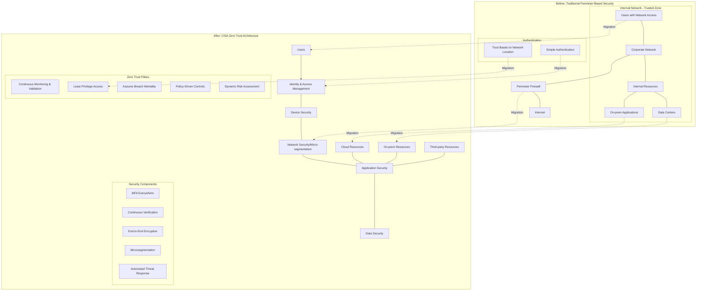

> I recently had the privilege of speaking on the 6th at the [ATARC Zero Trust Summit for Spring 2025](https://www.atarc.org/event/zt-2025-spring/).  Many thanks to [ATARC](https://www.atarc.org/), a terrific group of moderators, and my fellow speakers for a fantastic event.  **"Zero Trust Implementation: Lessons from the Federal Frontlines"** was a great place to tell stories of things we learned the hard way. 📖
> 
> 💭 This is a couple thoughts from that panel, in no particular order.
{: .prompt-info }

It's surprising how comprehensive the idea of "zero trust" has become.  What started as enabling multi-factor authentication and network segmentation now encompasses much more.  Even so, there's one critical oversight - **how do you trust the software all of these pillars rest on?** 🙈

## We have a good idea of what "zero trust" is

[CISA](https://cisa.gov) defines 5 pillars, each with 4 levels of maturity, in their [Zero Trust Maturity Model](https://www.cisa.gov/zero-trust-maturity-model)[^archive].  Every level has a definition with examples that may not be relevant to any particular system in a program.  It also has implementation details in perfect vendor-neutral language.  The applicability of each vendor's product to each problem is left out to not require constant maintenance as products change[^search].

{: .w-75 .rounded-10 }

Yet all of these pillars of _zero trust_ rest on a foundation of _highly trusted software_.  From managing authentication (identity), running applications (workloads), or the data that's collected/processed/stored - it's all software.

## Didn't we do this before?

{: .rounded-10 .shadow .w-50 .right }

Kind of, but not really, yeah ... 🤷🏻‍♀️

Much of these objectives are handled by newer compliance frameworks, specifically [NIST 800-53 rev. 5](https://csrc.nist.gov/pubs/sp/800/53/r5/upd1/final) for its' derivatives FISMA, FedRAMP, CMMC, and the like.  Many companies also took the opportunity to segment their networks and re-work their authentication and so much more.  How many folks _truly_ did all of this versus get their existing systems approved for risk management is debatable.  Even without pursuing a compliance framework, the same principles apply here.

Pick a pillar to focus on.  Take a whiteboard and your network inventory, draw out your network architecture, and start carving parts off.  Put a guess on how hard it'd be to improve that posture by one rank on that Zero Trust Maturity Model matrix.  Don't commit to a time or budget yet, just take a best guess at how much effort it'd be.  In my experience, good places to start are systems that:

- take a disproportionate amount of engineer time to maintain
- carry the highest security risk or vulnerability count
- cause more downtime
- services that are simple to replace with a SaaS offering that meets your compliance needs (identity providers and logging services seem to be the most common here to buy vs DIY)

Now that you have some set amount of time and budget to work with, figure out what's most impactful and do it.

## That sounds a lot like project management

Because it is. 🫠

Project management is how the right balance is found between the team/budget/time you have, the most impactful work that they can be doing, and achieving mission effectiveness with the strict security requirements of Zero Trust.  We can trade clichés about how "Rome wasn't built in a day" or "no one eats an elephant in a single bite" all day.  Technical project management is how many bites add up to an elephant. 🍽️🐘

No graphic drives home this better than a _simplified_ migration path flowchart, rendered in MermaidJS, below.  It shows the "traditional perimeter-based security" to a simplified zero trust architecture ... **and it's _A LOT_ to look at.**

## Teamwork makes the dream work

That gnarly diagram above?  For most enterprises or agencies that I work with, each of those boxes has multiple teams and stakeholders that will be involved at each move.  Collaboration is harder when resources are tight.  Based on my experience, **the key to standout performance here is clarity.**

1. Figure out who pays for things _up front_ (software, training, professional services, hardware, etc...).  This means money, yes, but also human hours and allowable disruptions for implementation.
2. Provide time to DO THE WORK.  This could mean safe deployment/rollback windows, smaller workloads during those sprints, executive "top cover", etc.
3. **Communicate both of these things unambiguously - then actually stick to them.**

The best part of working in the public sector is the mission-driven impact of everyone involved.  The big goals, small teams, limited budgets, and tight timelines all seem to matter less when folks genuinely care about getting things done.  Don't squander that with poor communication. 🌷

---

## Footnotes

[^search]: Speaking of vendors, we don't _always_ help.  A quick search for "cisa zero trust" returns sponsored content from vendors counting between 3 to 8 "pillars of zero trust" with little in common.
[^archive]: A copy of the CISA Zero Trust Maturity Model (version 2.0, published April 2023) is also saved [here](https://media.githubusercontent.com/media/some-natalie/some-natalie/main/assets/graphics/2025-03-09-zero-trust-software/CISA_Zero_Trust_Maturity_Model_Version_2_508c.pdf) for future reference.
